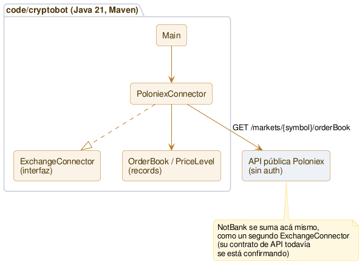

# Arquitectura

**Única fuente de verdad de la arquitectura *actual* de Cryptobot.** Este documento es **vivo**: refleja siempre el "ahora". Cada sprint que cambia la estructura lo actualiza, y además muestra su **delta** en su propio `sprints/sprint_NNNN.md`. Así la foto completa vive en un solo lugar (sin duplicar ni desincronizar — mismo criterio que el [roadmap](roadmap.md)) y cada sprint cuenta su evolución. La convención está en [metodologia.md](metodologia.md).

## Qué existe hoy (Sprint 0002, en curso)

Un único módulo Java (Maven), en `code/cryptobot/`. Todo lo que hace hoy: conectarse de solo lectura a la API pública de un exchange y traer un order book real.

**Piezas:**
- `com.cryptobot.marketdata.ExchangeConnector` — interfaz que cualquier exchange implementa: `fetchOrderBook(symbol) -> OrderBook`. Punto de extensión para sumar NotBank, BudaPRO, YoBit sin tocar lo demás.
- `com.cryptobot.marketdata.OrderBook` / `PriceLevel` — records inmutables, `BigDecimal` para precio y cantidad (nunca `double` — es plata).
- `com.cryptobot.marketdata.poloniex.PoloniexConnector` — primera implementación real, contra `https://api.poloniex.com/markets/{symbol}/orderBook`, pública, sin auth. Formato de símbolo: `{BASE}_{QUOTE}` (ej. `LTC_USDT`).
- `com.cryptobot.Main` — corre un fetch y muestra el spread real (ask/bid ejecutable, no "último precio").

**Todavía no existe:** persistencia de datos capturados, ejecución de nada, ni segundo exchange conectado.

## Cómo se mantiene este documento

- Es la **única fuente** de la arquitectura actual. Si un sprint la cambia, **se actualiza acá** y se muestra el **delta** en el `sprint_NNNN.md`.
- El *porqué* de cada decisión vive en las **Decisiones** del sprint donde se tomó (ver [hub.md](hub.md)); acá solo el *qué* y el *cómo* de la estructura actual.
