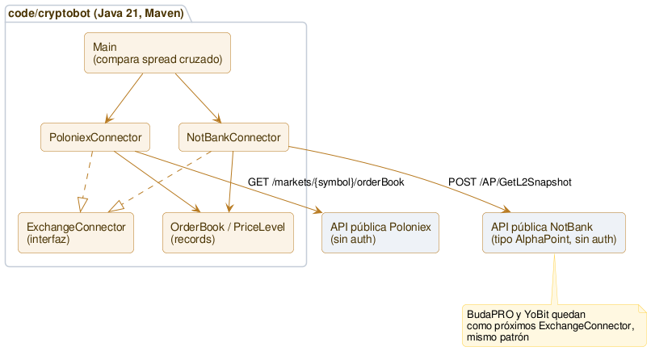

# Arquitectura

**Única fuente de verdad de la arquitectura *actual* de Cryptobot.** Este documento es **vivo**: refleja siempre el "ahora". Cada sprint que cambia la estructura lo actualiza, y además muestra su **delta** en su propio `sprints/sprint_NNNN.md`. Así la foto completa vive en un solo lugar (sin duplicar ni desincronizar — mismo criterio que el [roadmap](roadmap.md)) y cada sprint cuenta su evolución. La convención está en [metodologia.md](metodologia.md).

## Qué existe hoy (Sprint 0026, cerrado)

Nuevo paquete `com.cryptobot.dashboard` — visor web local de solo lectura sobre los CSV que ya escriben los 6 watchers, pedido por Marcelo para revisar "todo lo encontrado" de una corrida larga sin tener que leer los CSV a mano. Primer código web/HTTP del proyecto (hasta ahora todo era CLI puro).

- `WatchHealthAnalyzer` (Sprint 0019) se reusa **sin cambios** para la sección de salud — sigue siendo genérico por nombre de columna, 7mo formato distinto que confirma el diseño sin tocarlo.
- `com.cryptobot.dashboard.WatcherFormats`: registro estático de los 6 formatos (columnas de identidad + métrica principal por watcher) — lo único que `WatchHealthAnalyzer` no cubre a propósito.
- `com.cryptobot.dashboard.CombinationSeriesAnalyzer`: agrupa las filas por combinación (activo+exchanges, o triángulo+dirección) y calcula, por combinación, `consistencyPct = veces marcada REVISAR / veces que apareció` — la misma pregunta que la sesión respondió a mano esa noche para distinguir señal real (ZEC, ~100%) de ruido (MANA, ~11%). Marca con un aviso informativo (no descarta datos) cualquier combinación con `|métrica| > 50%` — mismo umbral que `CrossTriangleCheck`/`CrossTriangleWatcher` usan desde el Sprint 0012, aplicado acá como alerta visual de posible choque de ticker.
- `com.cryptobot.dashboard.DashboardServer`: `com.sun.net.httpserver.HttpServer` del JDK (sin dependencia nueva), puerto 8089 en `127.0.0.1`. Rutas: `/` (visor), `/api/files` (lista de CSV por watcher), `/api/dashboard?file=` (salud + combinaciones de un archivo, releído en cada request — sin caché, sin refresco automático). JSON armado a mano contra `Map`/`List` (no serialización automática de records) para no sumar `jackson-datatype-jsr310`.
- `src/main/resources/dashboard/index.html`: visor autocontenido, HTML/CSS/JS vanilla sin librerías externas.
- **Verificado en vivo contra la corrida nocturna, con los watchers todavía escribiendo**: `spread-watch` (~200.000 filas) respondió en ~0,3s por request; el caso ZEC/MANA se reprodujo automáticamente sin ajuste manual; `TOP_N` de combinaciones subió de 20 a 50 tras medir que el archivo más grande solo tuvo 33 combinaciones totales (20 tapaba justo los casos de baja consistencia); puerto 8080 tuvo que cambiarse a 8089 por un conflicto real con otro proyecto de Marcelo corriendo en esa máquina.
- **Fuera de alcance**: auto-refresh/WebSockets, autenticación, empaquetado standalone. No commiteado a git sin autorización explícita — regla del proyecto.

## Qué existía en el Sprint 0025

`FundingCrossExchangeWatcher` — versión continua de `FundingCrossExchangeCheck`, mismo salto que `CashAndCarryWatcher` fue para `CashAndCarryCheck` (Sprint 0015 → 0016). Descubre los activos con perpetuo en 2+ exchanges una sola vez al arrancar, corre en loop de 30s con `ParallelFetch`, y reusa `StalenessTracker` — pero solo en las patas de **precio** (bid del corto, ask del largo), no en el funding rate: ese cambia por diseño cada 8h, marcarlo "congelado" dentro de esa ventana sería ruido, no una señal de dato malo (mismo criterio que `CashAndCarryWatcher`). CSV de 12 columnas (`timestamp,asset,short_exchange,short_annualized_pct,long_exchange,long_annualized_pct,annualized_differential_pct,entry_fees_pct,breakeven_hours,stale,flag,error`) — `flag=REVISAR` en cualquier diferencial positivo (mismo criterio que `TriangleWatcher`/`CrossTriangleWatcher`, sin umbral inventado).

**Verificado en vivo:** 4 ciclos reales, 12 de 15 activos evaluables en cada uno, resultados estables ciclo a ciclo — salvo **APT, que cambió de signo** entre la foto del Sprint 0024 (diferencial negativo) y esta corrida (positivo, +10,95% anualizado) — evidencia real, no hipotética, de por qué hace falta un watcher y no alcanza con una sola foto. `WatchHealthReport` (Sprint 0019) analizó el CSV resultante sin ningún cambio de código — confirma que el diseño "genérico por nombre de columna" sigue funcionando en un 6to formato que nunca se pensó específicamente para él.

## Qué existía en el Sprint 0024

Primer código para la **hipótesis 05 (funding rate cross-exchange)** — priorizada #3 en el catálogo desde el Sprint 0001, nunca antes probada por falta de un segundo exchange con perpetuos accesibles. Con Bitfinex (Sprint 0023) ya conectado, se suman sus perpetuos y se construye la comparación contra Poloniex.

- `BitfinexConnector` gana `fetchPerpSymbols()`/`fetchPerpQuote(symbol)` — mismo patrón que `PoloniexConnector` (Sprint 0015), combinando `GET /ticker` (bid/ask) + `GET /status/deriv` (mark price, funding, próximo funding). El funding de Bitfinex corre en grilla fija de 8h (0:00/8:00/16:00 UTC, confirmado en su documentación y cruzado contra un timestamp real) — a diferencia de Poloniex, la API no expone la hora de INICIO del período actual, solo la del próximo, así que `fundingTime` se **deriva** (`nextFundingTime - 8h`), no se mide independiente cada vez.
- `ExchangeFees.PERP_TAKER_FEE` gana `"Bitfinex" → 0%` (mismo alcance de fee cero ya confirmado en el Sprint 0023, cubre derivados).
- `com.cryptobot.funding.FundingCrossExchangeCandidates`: descubre, por activo, en qué exchanges hay un perpetuo margined en USDT — necesita 2+ para poder comparar. Extracción de activo específica por exchange (`_USDT_PERP` para Poloniex, `{BASE}F0:{QUOTE}F0` con normalización UST→USDT para Bitfinex).
- `com.cryptobot.funding.FundingCrossExchangeSpread`: a diferencia de `CashAndCarrySpread` (una pata spot, una perpetuo), acá **las dos patas son perpetuos** — diseño "mejor de N candidatos" desde el arranque (no un bolt-on de 2 exchanges): entre todos los candidatos con liquidez suficiente, el de mayor funding **anualizado** es el corto, el de menor (en otro exchange) es el largo. Anualiza con el intervalo real de cada candidato, no asume que coinciden entre exchanges — y el breakeven se mide en **horas**, no en "períodos", por la misma razón.
- `FundingCrossExchangeCheck` (en `com.cryptobot`): foto en vivo, mismo patrón que `CashAndCarryCheck`.
- **Verificado en vivo — primera vez que la hipótesis 05 se prueba con datos reales**: 15 activos con perpetuo en ambos exchanges, 12 evaluables con liquidez suficiente. **12 de 12 con diferencial anualizado positivo** (breakeven entre 3,3h y 80,6h). Dos casos (FIL, BNB) con diferenciales extremos (funding de Bitfinex fuertemente negativo) — confirmados con profundidad real de mercado (~$120k–270k de notional en el book, no polvo), pero es una sola foto: la pregunta de persistencia (¿el diferencial se sostiene en el tiempo?) queda abierta, no se declara señal confirmada con un solo dato.

## Qué existía en el Sprint 0023

6to exchange conectado: **Bitfinex** — Marcelo ya tenía cuenta ahí (pendiente reverificar por el tiempo, no bloquea la Etapa 2). Mismo alcance que conectar CoinEx (Sprint 0021): conector + hipótesis 01, nada más.

- `com.cryptobot.marketdata.bitfinex.BitfinexConnector` — dos particularidades de formato propias, ninguna vista en los otros 5 conectores: el book es un **array plano combinado** (signo de la cantidad distingue bid/ask, hay que partirlo y ordenar cada lado a mano — `OrderBook` exige bids/asks pre-ordenados) y `UST` (ticker de Bitfinex para Tether) se **normaliza a `USDT`** al armar cada `Market`, confirmado contra `GET /v2/conf/pub:map:currency:label` — si no, los 63 mercados UST de Bitfinex nunca hubieran cruzado con los USDT de los demás exchanges en `TrackedAssets` (agrupa por string exacto).
- `ExchangeFees` gana `"Bitfinex" → 0,00%` — **fee cero real**, no un valor sin confirmar: permanente desde el 17/12/2025, spot y ~60 perpetuos, sin umbral de volumen (confirmado en el blog oficial de Bitfinex, corroborado por medios independientes).
- `TrackedAssets.all(...)` gana un 6to parámetro (`BitfinexConnector`) — `OverlapCheck`/`SpreadWatcher` actualizados.
- **Verificado en vivo:** `OverlapCheck` pasó de 436 a **450 activos**. Confirmada la normalización UST→USDT: BTC/USDT lista a Bitfinex junto a los demás exchanges, no aparece un grupo separado "BTC/UST". Las comparaciones que incluyen a Bitfinex muestran la fee combinada más baja de todo el proyecto (ej. 0,20% en vez de 0,40%+ cuando Bitfinex es una de las dos patas).
- **Fuera de alcance, backlog de alta prioridad:** futuros/funding de Bitfinex — con fee cero, es el candidato de mayor impacto esperado para cash-and-carry (04) y funding cross-exchange (05) de todo el backlog.

## Qué existía en el Sprint 0021

5to exchange conectado: **CoinEx** — elegido tras investigar Latoken/CoinEx/Bitrue (research, no asumido: API pública real, actividad genuina, disponibilidad para Chile confirmada contra la fuente oficial). Mismo alcance que tuvo conectar Buda/YoBit en el Sprint 0005: conector + hipótesis 01, nada más.

- `com.cryptobot.marketdata.coinex.CoinExConnector` — mismo patrón `ExchangeConnector` que los otros 4. Bids/asks como string (como Poloniex/Buda). Símbolo inválido/parámetro inválido → HTTP 200 con `"code" != 0` (mismo patrón de error "silencioso" que ya tenía YoBit con `"success"`).
- `ExchangeFees` gana `"CoinEx" → 0,20%` — una aproximación documentada: la fee real de CoinEx varía **por mercado individual** (751/242/6 mercados a 0,30%/0,20%/0,10%), a diferencia de los otros 4 exchanges (planos, o variando solo por tipo de moneda de cotización); 0,20% es lo confirmado en vivo para los majors que efectivamente se usan vía `TrackedAssets`.
- `TrackedAssets.all(...)` gana un 5to parámetro (`CoinExConnector`) — `OverlapCheck`/`SpreadWatcher` actualizados.
- **Verificado en vivo:** `OverlapCheck` pasó de 67 a **436 activos** con 2+ exchanges — CoinEx (999 mercados) cruza el umbral de "2+ exchanges" para muchos tickers que antes solo vivían en YoBit. Los 11 activos originales del Sprint 0007 siguen todos presentes.
- **Fuera de alcance, backlog nuevo:** futuros/funding rate de CoinEx (habilitaría la hipótesis 05, funding rate cross-exchange — la única priorizada del catálogo sin poder probarse hoy), CoinEx en triangular (02/03), CoinEx como candidato de spot en cash-and-carry (04).

## Qué existía en el Sprint 0020

Hipótesis 04 (cash-and-carry) suma YoBit como candidato de spot — antes solo competían Poloniex y NotBank. Medido en vivo antes de construir: de los 18 perpetuos de Poloniex, Buda no cubre ninguno en USDT (su universo es CLP/COP/PEN, 0 de 18) y YoBit cubre 6 (BTC, DOGE, ETH, LTC, TRX, XRP) — **por eso este sprint suma solo YoBit**; Buda queda backlog aparte porque sumarlo bien requeriría convertir CLP→USDT en vivo antes de comparar contra el perpetuo (que siempre es USDT), no un cambio chico.

- `com.cryptobot.funding.CashAndCarryCandidates` (nuevo): reemplaza el descubrimiento hardcodeado a "exactamente Poloniex + NotBank" que tenían `CashAndCarryCheck`/`CashAndCarryWatcher` desde el Sprint 0015 (cada uno con su propio `record Candidate` de 2 campos fijos). `discover(perpSymbols, List<CrossVenue>)` (testeable sin HTTP) agrupa los mercados USDT por activo base y arma un candidato por perpetuo que tenga 1+ venue — `CrossVenue` (de `marketdata`, Sprint 0012/0017) suma acá su 3er consumidor real.
- `CashAndCarrySpread.bookKey(exchange, symbol)`: mismo helper que ya tiene `CrossTriangleSpread`, evita repetir el armado de la key entre el fetch y el lookup.
- `CashAndCarryCheck`/`CashAndCarryWatcher` quedan generalizados a N fuentes de spot sin tocar `CashAndCarrySpread.evaluate` (ya recibía `List<SpotCandidate>` genérico desde el Sprint 0015).
- **Verificado en vivo**: BTC/DOGE/ETH/LTC/TRX/XRP pasaron de 2 a 3 venues (Poloniex, NotBank, YoBit), el resto de los 16 activos con candidato no cambió.

## Qué existía en el Sprint 0019

Nuevo paquete `com.cryptobot.report` — deja de analizarse a mano cada CSV largo. Los 5 formatos de watcher (`SpreadWatcher`/`TriangleWatcher`/`YobitTriangleWatcher`/`CrossTriangleWatcher`/`CashAndCarryWatcher`) comparten `timestamp` primero y `stale,flag,error` últimas tres, aunque el resto de columnas sea totalmente distinto — confirmado leyendo los 5 headers reales, no asumido. Una sola herramienta genérica por nombre de columna alcanza para los 5.

- `WatchHealthAnalyzer` (lógica pura, testeable con CSV sintético en memoria): una pasada por el archivo. Ciclos y huecos de tiempo se **miden** del propio archivo (mediana de los gaps entre timestamps distintos), no se asume un intervalo fijo — un gap > 3x esa mediana se marca hueco (heurística de partida, mismo tratamiento que `ParallelFetch.MAX_CONCURRENT_PER_EXCHANGE`). Cuenta `flag` por valor exacto, agrupa `error` por mensaje (separando el prefijo `"<clave>: "` que cada watcher antepone, así el mismo patrón en 40 símbolos cuenta como uno, no 40), cuenta tokens `|`-separados de `stale`. La columna `error` es la única que puede venir citada/escapada (mismo formato que `escapeCsv` ya escribe en los watchers) — se maneja con `split(",", N)` + desescapado del último campo, sin sumar una dependencia de parseo CSV.
- `WatchHealthReport` (CLI, `com.cryptobot.report`): imprime el reporte de uno o más archivos: `mvn exec:java -Dexec.mainClass=com.cryptobot.report.WatchHealthReport -Dexec.args="data/archivo.csv"`. Un archivo que falla no aborta los demás. Errores/stale se listan top 15 por frecuencia con nota explícita de cuántos quedan afuera — sin cap silencioso.
- **Verificado en vivo, no solo con datos sintéticos:** 2 ciclos reales de `YobitTriangleWatcher` (1.446 filas) — el reporte coincidió exacto con lo contado a mano por `grep`/`wc`. De paso, midió algo nuevo: cada ciclo de `YobitTriangleWatcher` tarda **~112s en la práctica**, no los 30s nominales — el fetch de 393 books bajo el semáforo de 8 concurrentes por exchange (`ParallelFetch`, Sprint 0014) domina el tiempo total cuando todos los books son del mismo exchange. Confirma, con un dato medido, la sospecha ya anotada en el backlog (Sprint 0014) sobre YoBit y concurrencia.

## Qué existía en el Sprint 0018

Hipótesis 02 (triangular intra-exchange) suma **YoBit**, hasta ahora solo probada en Poloniex. Antes de construir se midió en vivo (contra `TriangleFinder` real, sin escribir código nuevo): 340 triángulos anclados en USDT (393 order books únicos) vs. 7.520 anclados en BTC y 7.516 en ETH — se construyó **solo el ancla USDT**; BTC/ETH queda backlog explícito, no descartado (ver Decisiones en `sprint_0018.md`, motivado por el hallazgo del Sprint 0011: incluso el par más líquido de Poloniex, ETH/BTC, pasa ~91% del tiempo congelado).

- `ExchangeConnector` gana `fetchMarkets()` como método de interfaz (los 4 connectors ya lo implementaban con firma idéntica desde antes — declaración mecánica, cero lógica nueva). Habilita que código genérico reciba cualquier connector y liste sus mercados sin conocer el tipo concreto.
- `TriangleCheckRunner` (en `com.cryptobot`) y `TriangleWatchRunner` (en `com.cryptobot.watch`): la orquestación de `TriangleCheck`/`TriangleWatcher` (antes con Poloniex cableado adentro) se extrae a métodos parametrizados por `(ExchangeConnector, exchangeName, anchor[, outputFilePrefix])`. `TriangleCheck`/`TriangleWatcher` quedan como mains delgados que llaman al runner con Poloniex — mismo comportamiento, mismo CSV, verificado en vivo que el output no cambió. `YobitTriangleCheck`/`YobitTriangleWatcher` son los mains nuevos, mismos runners con YoBit.
- Verificado en vivo: 43 de 393 books (~11%) fallan con "sin bids/asks esperados" — mismo patrón de mercados sin liquidez del lado bid que ya apareció en el Sprint 0017 (`comp_btc`/`shib_btc`), acá a mayor escala por ser YoBit el exchange con más pares. Todos capturados como error por `ParallelFetch`, ninguno interrumpe la corrida. 0 de 680 direcciones con neto positivo — sin señal todavía en YoBit tampoco.

## Qué existía en el Sprint 0017

`TrackedAssets.all(...)` (hipótesis 01, usada por `SpreadWatcher`/`OverlapCheck`) dejó de devolver una lista fija de 11 activos elegidos a mano — ahora **descubre** en vivo qué activos cotizan en 2 o más de los 4 exchanges, mismo principio ya aplicado a lo triangular (`TriangleFinder`/`CrossTriangleFinder`, Sprint 0009/0012):
- `BudaConnector`/`YobitConnector` ganan `fetchMarkets()` (mismo patrón que `PoloniexConnector`/`NotBankConnector`) — Buda vía `GET /markets` (filtra `disabled`), YoBit vía `GET /info` (filtra `hidden`, symbol = la propia key del par, confirmado en el Sprint 0007 que separar por `_` es seguro).
- `TrackedAssets.discover(List<CrossVenue>)` (testeable con datos sintéticos, sin HTTP): agrupa por `"{base}/{quote}"` **exacto** — a diferencia de un triángulo, acá el orden de la moneda importa, no se normaliza. Un activo entra solo si aparece en 2+ exchanges distintos. Monedas de cotización soportadas: USDT, USDC, CLP, BTC — las mismas para las que `MinNotional` ya tiene umbral verificado; se excluyen a propósito COP/PEN/ARS/BRL (existen en NotBank/Buda) por no tener un umbral de nocional confirmado — usar el default de USDT asumiría que valen lo mismo, que no es cierto.
- `TrackedAssets.all(poloniex, notbank, buda, yobit)` — misma firma que antes, ahora llama `fetchMarkets()` de los 4 y arma `CrossVenue` para pasarle a `discover(...)`. `SpreadWatcher`/`OverlapCheck` no cambiaron.

**Dos refactors de arquitectura, necesarios antes de lo anterior** (evitar que `marketdata`, la capa de base, dependiera de `triangular`):
- `CrossVenue` se mueve de `com.cryptobot.triangular` a `com.cryptobot.marketdata` — con `TrackedAssets` como su segundo consumidor (además de lo cross-triangular), correspondía vivir en la capa base.
- `TriangleSpread.minNotionalFor` se extrae a `com.cryptobot.marketdata.MinNotional.forCurrency(currency)` — mismo motivo, `TrackedAssets` sería un 4to consumidor y no puede depender de `triangular`.

**Medido en vivo, no proyectado:** la corrida real de `OverlapCheck` con el nuevo descubrimiento encontró **67 activos** (vs. los 11 hardcodeados hasta el Sprint 0016) — los 11 originales siguen todos presentes, nada se perdió. Aparece un hallazgo de datos, no un bug: dos pares de YoBit (`comp_btc`, `shib_btc`) no tienen liquidez del lado bid — la API omite la clave `"bids"` en vez de mandar un array vacío — y el parser ya lo trata como error capturado por `ParallelFetch` (no crashea la corrida), consistente con el resto del proyecto.

## Qué existía en el Sprint 0016

`CashAndCarryWatcher` — versión continua de `CashAndCarryCheck`, mismo salto que `TriangleWatcher`/`CrossTriangleWatcher` fueron para sus respectivos checks. Descubre los perpetuos una sola vez al arrancar, corre en loop de 30s con `ParallelFetch`, y reusa `StalenessTracker` — pero solo en las patas de **precio** (spot ask, perpetuo bid), no en el funding rate: ese cambia por diseño cada 8h, marcarlo "congelado" dentro de esa ventana sería ruido, no una señal de dato malo. CSV largo con basis/funding/funding anualizado/fees de entrada/breakeven por ciclo — mismo criterio de "no colapsar en un solo número" que ya tiene `CashAndCarrySpread`.

## Qué existía en el Sprint 0015

Primer código para la **hipótesis 04 (funding rate cash-and-carry)** — distinta en naturaleza a las 3 anteriores: no arbitraje instantáneo, sino una posición que se mantiene abierta cobrando el funding rate. Solo Poloniex, de los 4 exchanges conectados, tiene perpetuos (confirmado en vivo: NotBank 0 instrumentos no-spot, Buda y YoBit solo spot).

- `PerpQuote` (en `marketdata`): precio (mark/bid/ask) y funding rate de un perpetuo, con el intervalo real derivado de las horas de funding actual/siguiente (no asumido — verificado en 8h exactas contra la API real).
- `PoloniexConnector` gana `fetchPerpSymbols()` (descubre los perpetuos reales vía `GET /v3/market/tickers`, filtra por sufijo `_USDT_PERP`) y `fetchPerpQuote(symbol)` (combina el ticker con `GET /v3/market/fundingRate`).
- `ExchangeFees` gana `perpTakerFee(exchange)`, separada de `takerFee` (spot) — hoy solo tiene valor para Poloniex (0,075%), y esa fee **no** sale de una API pública (Poloniex no expone una) sino de contenido de soporte del propio exchange — anotado como supuesto a confirmar en el backlog, mismo tratamiento que tuvo la fee de NotBank antes del Sprint 0008.
- `com.cryptobot.funding.CashAndCarrySpread`: a diferencia de `NetSpread`/`TriangleSpread`/`CrossTriangleSpread` (arbitraje instantáneo, un solo "neto"), acá no hay un solo número — se reporta basis, funding por período, funding anualizado, fees de entrada y períodos de breakeven por separado. Elige el spot de mejor costo neto entre Poloniex y NotBank (mismo principio de "mejor por pata" que `CrossTriangleSpread`, simplificado porque acá la pata spot siempre es "comprar").
- `CashAndCarryCheck` (en `com.cryptobot`): foto en vivo, usa `ParallelFetch` desde el diseño inicial (no como parche posterior).

## Qué existía en el Sprint 0014

`com.cryptobot.marketdata.ParallelFetch` — todos los watchers y checks pedían sus order books uno a la vez, en un `for` secuencial. Con `CrossTriangleWatcher` (168 books) el costo se hizo visible: el primer ciclo no llegaba a completarse ni en 2 minutos. `ParallelFetch.fetchAll(List<FetchTask<K,V>>)` corre las tareas con **virtual threads** (JDK 21) — cada conector sigue exactamente igual (`HttpClient.send()`, bloqueante), la concurrencia se agrega solo en la capa que ya tenía el `for` de fetches. Sin límite entre exchanges distintos (rate limits independientes); acotado dentro de un mismo exchange con un `Semaphore` (`MAX_CONCURRENT_PER_EXCHANGE = 8`, supuesto conservador, no un dato medido — ver backlog). Un fetch que falla cae en `Outcome.errors()` sin cancelar a los demás.

Aplicado a los 6 puntos donde se pedían books: `SpreadWatcher`, `OverlapCheck`, `TriangleWatcher`, `TriangleCheck`, `CrossTriangleWatcher`, `CrossTriangleCheck`, y por consistencia también `Main`. Mismo patrón en los seis: armar la lista de `FetchTask` a partir de lo que ya se iteraba, un solo `fetchAll()` por ciclo, y el trabajo por-ítem (staleness, filas de error) se mueve a iterar sobre `Outcome.results()`/`errors()` en vez de hacerlo inline dentro del fetch.

**Medido, no solo esperado:** `CrossTriangleCheck` (168 books) pasó de no completar un ciclo en 120s a **12,3s totales**. `TriangleCheck` (40 books, un exchange) a 8,7s. `OverlapCheck` (27 books, 4 exchanges) a 2,8s.

## Qué existía en el Sprint 0013

`CrossTriangleWatcher` — versión continua de `CrossTriangleCheck`, mismo salto que `TriangleWatcher` fue para `TriangleCheck` (Sprint 0009→0010). Descubre los 69 triángulos Poloniex+NotBank una sola vez al arrancar, pide cada uno de los 168 order books únicos una sola vez por ciclo, y reusa `StalenessTracker` sin cambios. Suma el mismo umbral de implausibilidad de `CrossTriangleCheck` (Sprint 0012, el hallazgo del choque de tickers BOB) — cualquier resultado con `|bruto| > 50%` se marca `IMPLAUSIBLE` en el CSV en vez de contarse como señal real.

## Qué existía en el Sprint 0012

Primer código para la **hipótesis 03 (triangular cross-exchange)** — reparte las 3 patas de un ciclo entre exchanges distintos, en vez de exigir que las tres vivan en el mismo (hipótesis 02). Nuevo, sobre Poloniex + NotBank:
- `CrossVenue` (en `triangular`): un mercado concreto en un exchange concreto — análogo a `TrackedAsset.Venue`, pero con el `Market` (base/quote) adjunto, no solo el símbolo.
- `CrossTriangle`: como `Triangle`, pero cada pata tiene una **lista** de exchanges candidatos, no uno solo. Gana `isNecessityCycle()` — distingue si el ciclo existe completo en al menos un exchange individual ("por optimización") o si ningún exchange lo tiene completo ("por necesidad", el caso que el triangular intra-exchange no podría operar bajo ninguna circunstancia).
- `CrossTriangleFinder`: mismo algoritmo que `TriangleFinder`, pero opera sobre la **unión** de mercados de varios exchanges, agrupando por par de monedas en vez de quedarse con un mercado por par — así aparecen los ciclos "por necesidad".
- `CrossTriangleSpread`: mismo principio de composición que `TriangleSpread`, pero en cada pata, si hay más de un exchange candidato, evalúa todos y toma el de mejor resultado **neto** (no el de mejor precio bruto — puede perder por tener una fee más alta).
- `CrossTriangleCheck` (en `com.cryptobot`): foto en vivo, marca cada triángulo como necesidad/optimización.
- `NotBankConnector` gana `fetchMarkets()` (mismo patrón que `PoloniexConnector` desde el Sprint 0009). `TriangleSpread.minNotionalFor` suma CLP (con NotBank en el universo, una pata puede terminar cotizada ahí).

**Hallazgo de la verificación en vivo, corregido en el propio código:** un resultado con bruto de +2.158.104% resultó ser un choque de tickers — el "BOB" de Poloniex es un token cripto barato, el "BOB" de NotBank es el Boliviano (moneda fiat) — dos activos distintos que comparten el mismo código de 3 letras. `CrossTriangleFinder` los trató como la misma moneda porque solo compara el string. `CrossTriangleCheck` marca cualquier resultado con `|bruto| > 50%` como implausible en vez de reportarlo como señal real — parche a nivel de reporte, no una solución de identidad de activos (queda en el backlog).

## Qué existía en el Sprint 0010

`TriangleWatcher` — la versión continua de `TriangleCheck`, mismo salto que `SpreadWatcher` fue para `OverlapCheck` en su momento (Sprint 0002→0003). Descubre los 23 triángulos una sola vez al arrancar (los mercados de un exchange no cambian en el rato que dura una corrida), y en cada ciclo pide cada uno de los ~40 order books únicos una sola vez, evalúa las dos direcciones de los 23 triángulos, y reusa `StalenessTracker` tal cual para marcar patas de precio congelado.

Para que el detector de staleness supiera qué pata usó cada dirección, `TriangleSpread.Result` ganó un campo `legs()` — qué símbolo y lado del book (bid/ask) usó cada una de las 3 conversiones del ciclo. `minNotionalFor` pasó de privado a público en `TriangleSpread`, para que `TriangleWatcher` filtre liquidez con el mismo umbral al observar staleness.

## Qué existía en el Sprint 0009

Primer código para la **hipótesis 02 (triangular intra-exchange)** — hasta ahora todo el código era sobre la 01 (spot cross-exchange). Nuevo paquete `com.cryptobot.triangular`, independiente de `watch`/`OverlapCheck`:
- `Market` (en `marketdata`, reusable por cualquier exchange): activo base + moneda de cotización + símbolo — resultado de listar **todos** los mercados de un exchange, no un símbolo elegido a mano. `PoloniexConnector` gana `fetchMarkets()` (`GET /markets`, filtra `state=NORMAL`).
- `TriangleFinder`: genérico, no atado a Poloniex — dado un ancla (ej. "USDT"), encuentra qué monedas cotizan contra ella y además tienen mercado directo entre sí, y arma los `Triangle` reales. Nada hardcodeado: en la corrida en vivo encontró 23 triángulos en Poloniex, más de los que se habían contado a mano explorando manualmente.
- `TriangleSpread`: cálculo separado de `NetSpread` — un triángulo **compone** un monto real a través de 3 conversiones (no es una resta de dos precios), así que se parte de 1 unidad de la moneda ancla y se va multiplicando por cada conversión (bid o ask según si esa pata vende o compra la base del mercado) y por `(1 - fee)` de esa pata. Reusa `ExchangeFees.takerFee`, no reusa la lógica de `NetSpread`.
- `TriangleCheck` (en `com.cryptobot`, paralelo a `OverlapCheck`): foto en vivo, no continua todavía — descubre los triángulos, pide cada order book único una sola vez (se comparten entre triángulos, ej. BTC/USDT aparece en casi todos), evalúa las dos direcciones de cada uno.

## Qué existía en el Sprint 0008

`ExchangeFees` deja de usar una estimación (0,60% flat) para NotBank y pasa a usar su fee real, encontrada en vivo contra la propia API pública de tarifas del exchange (no una fuente de terceros). Como esa fee varía según si el par cotiza contra una fiat/stablecoin o contra otra cripto, `ExchangeFees.takerFee` y `NetSpread.evaluate` ahora reciben la moneda de cotización como parámetro — antes solo importaba el exchange. `TrackedAsset` gana `quoteCurrency()` (se deriva del propio `label`, ej. "BTC/USDT" → "USDT") para no duplicar ese dato en cada lugar que lo necesita.

## Qué existía en el Sprint 0007

Se reemplaza el modelo de "2 exchanges fijos" por uno de **N exchanges combinables**. `TrackedAsset` (activo + moneda de cotización + umbral de nocional mínimo + lista de `Venue`, cada uno un exchange con su símbolo nativo) reemplaza a `TrackedPair` (que tenía exactamente 2 símbolos cableados). `TrackedAssets` es el registro único de qué activo cotiza en qué exchange — antes esa información vivía duplicada y desalineada entre `SpreadWatcher` (8 pares, solo Poloniex/NotBank) y `OverlapCheck` (11 combinaciones elegidas a mano); ahora ambos leen de la misma fuente y generan **todas** las combinaciones posibles de a 2 exchanges por activo (`C(n,2)`), no solo las que alguien pensó en cablear.

`NetSpread` extrae la cuenta "bruto → menos fee de taker de ambas patas → neto" (que hasta el Sprint 0006 estaba duplicada, casi textual, en los dos programas) a una función pura compartida.

`SpreadWatcher` pasó de comparar 2 exchanges (16 fetches/ciclo) a 4 (~27 fetches/ciclo) sin tocar el intervalo de 30s — sigue entrando cómodo. El CSV pasó de **formato ancho** (columnas fijas para 2 exchanges) a **formato largo**: una fila por combinación×dirección×ciclo (`timestamp,asset,buy_exchange,sell_exchange,buy_price,sell_price,gross_pct,fees_pct,net_pct,stale,flag,error`) — la única forma de representar 2, 3 o 4 exchanges por activo sin columnas que no generalizan. Los CSV de corridas anteriores (formato ancho) quedan como registro histórico, sin migrar.

## Qué existía en el Sprint 0006

Se suma `ExchangeFees`: registro simple de la fee de taker real por exchange (Poloniex 0,20%, NotBank 0,60% estimado — pendiente de confirmar, Buda 0,80%, YoBit 0,20%; fuente de cada valor en [entorno.md](entorno.md)). Tanto `OverlapCheck` como `SpreadWatcher` restan la fee de ambas patas al spread bruto antes de decidir si algo es interesante — el modelo de ejecución asumido sigue siendo taker-taker (dos órdenes de mercado). `SpreadWatcher` suma dos columnas al CSV (`*_net_pct`) y el flag `REVISAR` ahora se dispara por spread **neto** positivo, no bruto. Cierra una brecha abierta desde el cierre del Sprint 0002: antes, un spread bruto positivo se descartaba a mano leyendo el número; ahora el programa ya dice si sobrevive a fees.

## Qué existía en el Sprint 0005

Se suman dos conectores nuevos: `BudaConnector` (Buda.com) y `YobitConnector` (YoBit) — mismo patrón `ExchangeConnector` que Poloniex/NotBank, sin cambiar nada de lo existente. Cada exchange tiene su propio formato de símbolo y su propia forma de mandar precios (Buda: string, igual que Poloniex; YoBit: número JSON, requiere `DeserializationFeature.USE_BIG_DECIMAL_FOR_FLOATS` para no perder precisión). Se suma `OverlapCheck`: comparación en vivo, snapshot único (no continua todavía), de los pares donde estos exchanges overlapean con Poloniex/NotBank sin necesitar conversión de moneda — filtra por nocional mínimo igual que `SpreadWatcher`, con umbral distinto por moneda de cotización (USDT/CLP/BTC).

**Todavía no integrados a `SpreadWatcher`** — la corrida continua sigue siendo solo Poloniex vs. NotBank; sumar Buda/YoBit ahí es la siguiente decisión de diseño (ver Cierre del sprint).

## Qué existía en el Sprint 0004

Se suma `StalenessTracker`: por cada precio observado (bid/ask, por exchange, por par), cuenta cuántos ciclos seguidos lleva sin cambiar — si supera un umbral (10 ciclos, ~5 minutos), lo marca. No descarta la fila, la señala: un precio quieto no prueba que el mercado es falso, pero merece revisión. Nació de la primera corrida nocturna real: XTZ en Poloniex quedó exactamente en el mismo precio 7 horas seguidas — el filtro de liquidez (Sprint 0003) no lo detectaba porque el problema no era el tamaño.

## Qué existía en el Sprint 0003

Se suma `SpreadWatcher`: en vez de correr una vez, corre en loop (30s por defecto) y registra cada observación en un CSV bajo `data/` (no versionado — son datos capturados, no código ni doc). Usa los mismos `PoloniexConnector`/`NotBankConnector` de la 0002, sin cambios ahí. `OrderBook` ganó `bestBidAbove`/`bestAskAbove`: filtran por valor nocional mínimo antes de considerar un nivel "el mejor precio" — sin esto, una orden vieja y chica aislada en el book puede reportarse como el mejor precio y generar un spread falso (pasó en vivo con XTZ en Poloniex durante la verificación de este sprint).

## Qué existía en el Sprint 0002

Un único módulo Java (Maven), en `code/cryptobot/`. Se conecta de solo lectura a dos exchanges reales y compara el spread ejecutable entre ambos.

**Piezas:**
- `com.cryptobot.marketdata.ExchangeConnector` — interfaz que cualquier exchange implementa: `fetchOrderBook(symbol) -> OrderBook`. Punto de extensión para sumar BudaPRO, YoBit sin tocar lo demás.
- `com.cryptobot.marketdata.OrderBook` / `PriceLevel` — records inmutables, `BigDecimal` para precio y cantidad (nunca `double` — es plata).
- `com.cryptobot.marketdata.poloniex.PoloniexConnector` — contra `https://api.poloniex.com/markets/{symbol}/orderBook`, pública, sin auth. Símbolo: `{BASE}_{QUOTE}` (ej. `LTC_USDT`).
- `com.cryptobot.marketdata.notbank.NotBankConnector` — contra `https://api.notbank.exchange` (host confirmado a mano, no está en la doc pública), plataforma tipo AlphaPoint: resuelve el símbolo a un `InstrumentId` numérico vía `GetInstruments`, después pide `GetL2Snapshot`. Respuesta en filas de array posicional, no objetos con nombre — parseo documentado en el código y en [entorno.md](entorno.md).
- `com.cryptobot.Main` — trae el book de los dos exchanges para el mismo par (LTC/USDT) y calcula el spread cruzado real en las dos direcciones, igual al cálculo que se hacía a mano en la sesión de exploración manual.

**Todavía no existe (a esta altura del Sprint 0002):** persistencia de datos capturados, ejecución de nada, BudaPRO/YoBit conectados, ni cálculo de fees/slippage sobre el spread bruto. (Buda/YoBit se conectaron en el Sprint 0005 — ver arriba; fees/slippage siguen pendientes.)

## Cómo se mantiene este documento

- Es la **única fuente** de la arquitectura actual. Si un sprint la cambia, **se actualiza acá** y se muestra el **delta** en el `sprint_NNNN.md`.
- El *porqué* de cada decisión vive en las **Decisiones** del sprint donde se tomó (ver [hub.md](hub.md)); acá solo el *qué* y el *cómo* de la estructura actual.
