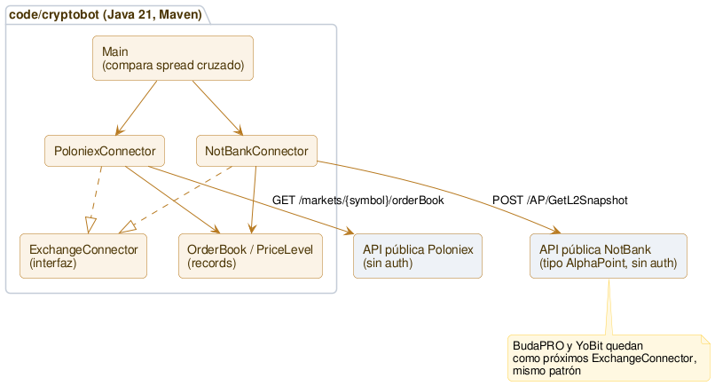

# Arquitectura

**Única fuente de verdad de la arquitectura *actual* de Cryptobot.** Este documento es **vivo**: refleja siempre el "ahora". Cada sprint que cambia la estructura lo actualiza, y además muestra su **delta** en su propio `sprints/sprint_NNNN.md`. Así la foto completa vive en un solo lugar (sin duplicar ni desincronizar — mismo criterio que el [roadmap](roadmap.md)) y cada sprint cuenta su evolución. La convención está en [metodologia.md](metodologia.md).

## Qué existe hoy (Sprint 0005, cerrado)

Se suman dos conectores nuevos: `BudaConnector` (Buda.com) y `YobitConnector` (YoBit) — mismo patrón `ExchangeConnector` que Poloniex/NotBank, sin cambiar nada de lo existente. Cada exchange tiene su propio formato de símbolo y su propia forma de mandar precios (Buda: string, igual que Poloniex; YoBit: número JSON, requiere `DeserializationFeature.USE_BIG_DECIMAL_FOR_FLOATS` para no perder precisión). Se suma `OverlapCheck`: comparación en vivo, snapshot único (no continua todavía), de los pares donde estos exchanges overlapean con Poloniex/NotBank sin necesitar conversión de moneda — filtra por nocional mínimo igual que `SpreadWatcher`, con umbral distinto por moneda de cotización (USDT/CLP/BTC).

**Todavía no integrados a `SpreadWatcher`** — la corrida continua sigue siendo solo Poloniex vs. NotBank; sumar Buda/YoBit ahí es la siguiente decisión de diseño (ver Cierre del sprint).

## Qué existía en el Sprint 0004

Se suma `StalenessTracker`: por cada precio observado (bid/ask, por exchange, por par), cuenta cuántos ciclos seguidos lleva sin cambiar — si supera un umbral (10 ciclos, ~5 minutos), lo marca. No descarta la fila, la señala: un precio quieto no prueba que el mercado es falso, pero merece revisión. Nació de la primera corrida nocturna real: XTZ en Poloniex quedó exactamente en el mismo precio 7 horas seguidas — el filtro de liquidez (Sprint 0003) no lo detectaba porque el problema no era el tamaño.

## Qué existía en el Sprint 0003

Se suma `SpreadWatcher`: en vez de correr una vez, corre en loop (30s por defecto) y registra cada observación en un CSV bajo `data/` (no versionado — son datos capturados, no código ni doc). Usa los mismos `PoloniexConnector`/`NotBankConnector` de la 0002, sin cambios ahí. `OrderBook` ganó `bestBidAbove`/`bestAskAbove`: filtran por valor nocional mínimo antes de considerar un nivel "el mejor precio" — sin esto, una orden vieja y chica aislada en el book puede reportarse como el mejor precio y generar un spread falso (pasó en vivo con XTZ en Poloniex durante la verificación de este sprint).

## Qué existía en el Sprint 0002

Un único módulo Java (Maven), en `code/cryptobot/`. Se conecta de solo lectura a dos exchanges reales y compara el spread ejecutable entre ambos.

**Piezas:**
- `com.cryptobot.marketdata.ExchangeConnector` — interfaz que cualquier exchange implementa: `fetchOrderBook(symbol) -> OrderBook`. Punto de extensión para sumar BudaPRO, YoBit sin tocar lo demás.
- `com.cryptobot.marketdata.OrderBook` / `PriceLevel` — records inmutables, `BigDecimal` para precio y cantidad (nunca `double` — es plata).
- `com.cryptobot.marketdata.poloniex.PoloniexConnector` — contra `https://api.poloniex.com/markets/{symbol}/orderBook`, pública, sin auth. Símbolo: `{BASE}_{QUOTE}` (ej. `LTC_USDT`).
- `com.cryptobot.marketdata.notbank.NotBankConnector` — contra `https://api.notbank.exchange` (host confirmado a mano, no está en la doc pública), plataforma tipo AlphaPoint: resuelve el símbolo a un `InstrumentId` numérico vía `GetInstruments`, después pide `GetL2Snapshot`. Respuesta en filas de array posicional, no objetos con nombre — parseo documentado en el código y en [entorno.md](entorno.md).
- `com.cryptobot.Main` — trae el book de los dos exchanges para el mismo par (LTC/USDT) y calcula el spread cruzado real en las dos direcciones, igual al cálculo que se hacía a mano en la sesión de exploración manual.

**Todavía no existe (a esta altura del Sprint 0002):** persistencia de datos capturados, ejecución de nada, BudaPRO/YoBit conectados, ni cálculo de fees/slippage sobre el spread bruto. (Buda/YoBit se conectaron en el Sprint 0005 — ver arriba; fees/slippage siguen pendientes.)

## Cómo se mantiene este documento

- Es la **única fuente** de la arquitectura actual. Si un sprint la cambia, **se actualiza acá** y se muestra el **delta** en el `sprint_NNNN.md`.
- El *porqué* de cada decisión vive en las **Decisiones** del sprint donde se tomó (ver [hub.md](hub.md)); acá solo el *qué* y el *cómo* de la estructura actual.
