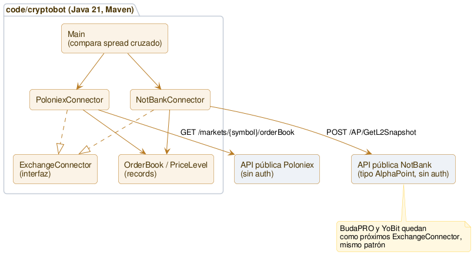

# Arquitectura

**Única fuente de verdad de la arquitectura *actual* de Cryptobot.** Este documento es **vivo**: refleja siempre el "ahora". Cada sprint que cambia la estructura lo actualiza, y además muestra su **delta** en su propio `sprints/sprint_NNNN.md`. Así la foto completa vive en un solo lugar (sin duplicar ni desincronizar — mismo criterio que el [roadmap](roadmap.md)) y cada sprint cuenta su evolución. La convención está en [metodologia.md](metodologia.md).

## Qué existe hoy (Sprint 0010, cerrado)

`TriangleWatcher` — la versión continua de `TriangleCheck`, mismo salto que `SpreadWatcher` fue para `OverlapCheck` en su momento (Sprint 0002→0003). Descubre los 23 triángulos una sola vez al arrancar (los mercados de un exchange no cambian en el rato que dura una corrida), y en cada ciclo pide cada uno de los ~40 order books únicos una sola vez, evalúa las dos direcciones de los 23 triángulos, y reusa `StalenessTracker` tal cual para marcar patas de precio congelado.

Para que el detector de staleness supiera qué pata usó cada dirección, `TriangleSpread.Result` ganó un campo `legs()` — qué símbolo y lado del book (bid/ask) usó cada una de las 3 conversiones del ciclo. `minNotionalFor` pasó de privado a público en `TriangleSpread`, para que `TriangleWatcher` filtre liquidez con el mismo umbral al observar staleness.

## Qué existía en el Sprint 0009

Primer código para la **hipótesis 02 (triangular intra-exchange)** — hasta ahora todo el código era sobre la 01 (spot cross-exchange). Nuevo paquete `com.cryptobot.triangular`, independiente de `watch`/`OverlapCheck`:
- `Market` (en `marketdata`, reusable por cualquier exchange): activo base + moneda de cotización + símbolo — resultado de listar **todos** los mercados de un exchange, no un símbolo elegido a mano. `PoloniexConnector` gana `fetchMarkets()` (`GET /markets`, filtra `state=NORMAL`).
- `TriangleFinder`: genérico, no atado a Poloniex — dado un ancla (ej. "USDT"), encuentra qué monedas cotizan contra ella y además tienen mercado directo entre sí, y arma los `Triangle` reales. Nada hardcodeado: en la corrida en vivo encontró 23 triángulos en Poloniex, más de los que se habían contado a mano explorando manualmente.
- `TriangleSpread`: cálculo separado de `NetSpread` — un triángulo **compone** un monto real a través de 3 conversiones (no es una resta de dos precios), así que se parte de 1 unidad de la moneda ancla y se va multiplicando por cada conversión (bid o ask según si esa pata vende o compra la base del mercado) y por `(1 - fee)` de esa pata. Reusa `ExchangeFees.takerFee`, no reusa la lógica de `NetSpread`.
- `TriangleCheck` (en `com.cryptobot`, paralelo a `OverlapCheck`): foto en vivo, no continua todavía — descubre los triángulos, pide cada order book único una sola vez (se comparten entre triángulos, ej. BTC/USDT aparece en casi todos), evalúa las dos direcciones de cada uno.

## Qué existía en el Sprint 0008

`ExchangeFees` deja de usar una estimación (0,60% flat) para NotBank y pasa a usar su fee real, encontrada en vivo contra la propia API pública de tarifas del exchange (no una fuente de terceros). Como esa fee varía según si el par cotiza contra una fiat/stablecoin o contra otra cripto, `ExchangeFees.takerFee` y `NetSpread.evaluate` ahora reciben la moneda de cotización como parámetro — antes solo importaba el exchange. `TrackedAsset` gana `quoteCurrency()` (se deriva del propio `label`, ej. "BTC/USDT" → "USDT") para no duplicar ese dato en cada lugar que lo necesita.

## Qué existía en el Sprint 0007

Se reemplaza el modelo de "2 exchanges fijos" por uno de **N exchanges combinables**. `TrackedAsset` (activo + moneda de cotización + umbral de nocional mínimo + lista de `Venue`, cada uno un exchange con su símbolo nativo) reemplaza a `TrackedPair` (que tenía exactamente 2 símbolos cableados). `TrackedAssets` es el registro único de qué activo cotiza en qué exchange — antes esa información vivía duplicada y desalineada entre `SpreadWatcher` (8 pares, solo Poloniex/NotBank) y `OverlapCheck` (11 combinaciones elegidas a mano); ahora ambos leen de la misma fuente y generan **todas** las combinaciones posibles de a 2 exchanges por activo (`C(n,2)`), no solo las que alguien pensó en cablear.

`NetSpread` extrae la cuenta "bruto → menos fee de taker de ambas patas → neto" (que hasta el Sprint 0006 estaba duplicada, casi textual, en los dos programas) a una función pura compartida.

`SpreadWatcher` pasó de comparar 2 exchanges (16 fetches/ciclo) a 4 (~27 fetches/ciclo) sin tocar el intervalo de 30s — sigue entrando cómodo. El CSV pasó de **formato ancho** (columnas fijas para 2 exchanges) a **formato largo**: una fila por combinación×dirección×ciclo (`timestamp,asset,buy_exchange,sell_exchange,buy_price,sell_price,gross_pct,fees_pct,net_pct,stale,flag,error`) — la única forma de representar 2, 3 o 4 exchanges por activo sin columnas que no generalizan. Los CSV de corridas anteriores (formato ancho) quedan como registro histórico, sin migrar.

## Qué existía en el Sprint 0006

Se suma `ExchangeFees`: registro simple de la fee de taker real por exchange (Poloniex 0,20%, NotBank 0,60% estimado — pendiente de confirmar, Buda 0,80%, YoBit 0,20%; fuente de cada valor en [entorno.md](entorno.md)). Tanto `OverlapCheck` como `SpreadWatcher` restan la fee de ambas patas al spread bruto antes de decidir si algo es interesante — el modelo de ejecución asumido sigue siendo taker-taker (dos órdenes de mercado). `SpreadWatcher` suma dos columnas al CSV (`*_net_pct`) y el flag `REVISAR` ahora se dispara por spread **neto** positivo, no bruto. Cierra una brecha abierta desde el cierre del Sprint 0002: antes, un spread bruto positivo se descartaba a mano leyendo el número; ahora el programa ya dice si sobrevive a fees.

## Qué existía en el Sprint 0005

Se suman dos conectores nuevos: `BudaConnector` (Buda.com) y `YobitConnector` (YoBit) — mismo patrón `ExchangeConnector` que Poloniex/NotBank, sin cambiar nada de lo existente. Cada exchange tiene su propio formato de símbolo y su propia forma de mandar precios (Buda: string, igual que Poloniex; YoBit: número JSON, requiere `DeserializationFeature.USE_BIG_DECIMAL_FOR_FLOATS` para no perder precisión). Se suma `OverlapCheck`: comparación en vivo, snapshot único (no continua todavía), de los pares donde estos exchanges overlapean con Poloniex/NotBank sin necesitar conversión de moneda — filtra por nocional mínimo igual que `SpreadWatcher`, con umbral distinto por moneda de cotización (USDT/CLP/BTC).

**Todavía no integrados a `SpreadWatcher`** — la corrida continua sigue siendo solo Poloniex vs. NotBank; sumar Buda/YoBit ahí es la siguiente decisión de diseño (ver Cierre del sprint).

## Qué existía en el Sprint 0004

Se suma `StalenessTracker`: por cada precio observado (bid/ask, por exchange, por par), cuenta cuántos ciclos seguidos lleva sin cambiar — si supera un umbral (10 ciclos, ~5 minutos), lo marca. No descarta la fila, la señala: un precio quieto no prueba que el mercado es falso, pero merece revisión. Nació de la primera corrida nocturna real: XTZ en Poloniex quedó exactamente en el mismo precio 7 horas seguidas — el filtro de liquidez (Sprint 0003) no lo detectaba porque el problema no era el tamaño.

## Qué existía en el Sprint 0003

Se suma `SpreadWatcher`: en vez de correr una vez, corre en loop (30s por defecto) y registra cada observación en un CSV bajo `data/` (no versionado — son datos capturados, no código ni doc). Usa los mismos `PoloniexConnector`/`NotBankConnector` de la 0002, sin cambios ahí. `OrderBook` ganó `bestBidAbove`/`bestAskAbove`: filtran por valor nocional mínimo antes de considerar un nivel "el mejor precio" — sin esto, una orden vieja y chica aislada en el book puede reportarse como el mejor precio y generar un spread falso (pasó en vivo con XTZ en Poloniex durante la verificación de este sprint).

## Qué existía en el Sprint 0002

Un único módulo Java (Maven), en `code/cryptobot/`. Se conecta de solo lectura a dos exchanges reales y compara el spread ejecutable entre ambos.

**Piezas:**
- `com.cryptobot.marketdata.ExchangeConnector` — interfaz que cualquier exchange implementa: `fetchOrderBook(symbol) -> OrderBook`. Punto de extensión para sumar BudaPRO, YoBit sin tocar lo demás.
- `com.cryptobot.marketdata.OrderBook` / `PriceLevel` — records inmutables, `BigDecimal` para precio y cantidad (nunca `double` — es plata).
- `com.cryptobot.marketdata.poloniex.PoloniexConnector` — contra `https://api.poloniex.com/markets/{symbol}/orderBook`, pública, sin auth. Símbolo: `{BASE}_{QUOTE}` (ej. `LTC_USDT`).
- `com.cryptobot.marketdata.notbank.NotBankConnector` — contra `https://api.notbank.exchange` (host confirmado a mano, no está en la doc pública), plataforma tipo AlphaPoint: resuelve el símbolo a un `InstrumentId` numérico vía `GetInstruments`, después pide `GetL2Snapshot`. Respuesta en filas de array posicional, no objetos con nombre — parseo documentado en el código y en [entorno.md](entorno.md).
- `com.cryptobot.Main` — trae el book de los dos exchanges para el mismo par (LTC/USDT) y calcula el spread cruzado real en las dos direcciones, igual al cálculo que se hacía a mano en la sesión de exploración manual.

**Todavía no existe (a esta altura del Sprint 0002):** persistencia de datos capturados, ejecución de nada, BudaPRO/YoBit conectados, ni cálculo de fees/slippage sobre el spread bruto. (Buda/YoBit se conectaron en el Sprint 0005 — ver arriba; fees/slippage siguen pendientes.)

## Cómo se mantiene este documento

- Es la **única fuente** de la arquitectura actual. Si un sprint la cambia, **se actualiza acá** y se muestra el **delta** en el `sprint_NNNN.md`.
- El *porqué* de cada decisión vive en las **Decisiones** del sprint donde se tomó (ver [hub.md](hub.md)); acá solo el *qué* y el *cómo* de la estructura actual.
