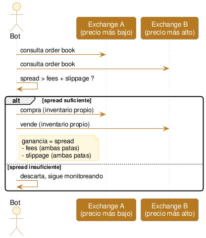

# Arbitraje spot cross-exchange

Comprar un activo donde está más barato y venderlo casi al mismo tiempo donde está más caro — mismo par, dos exchanges distintos. La ganancia es el [spread](../glosario.md#spread) entre ambos precios, menos [fees](../glosario.md#fees) y [slippage](../glosario.md#slippage).

## Qué es

Un mismo par (ej. BTC/USDT) cotiza en paralelo en distintos exchanges, que son mercados independientes — no comparten un único [order book](<../glosario.md#Order book>) global. En condiciones normales, sus precios se mantienen muy cerca porque hay actores conectando ambos mercados constantemente (ver [Estado actual](<#Estado actual y expectativas reales>)), pero momentáneamente pueden desalinearse: un evento local en un exchange (una orden grande, una noticia, un problema técnico) mueve el precio ahí sin que el resto del mercado reaccione todavía.

Hay dos formas de ejecutar la estrategia cuando aparece esa desalineación, y son muy distintas en viabilidad:

**1. Transferencia al vuelo.** Se detecta el spread, se compra el activo en el exchange más barato, se retira de ese exchange, se espera la confirmación en la blockchain, se deposita en el exchange más caro, y se vende ahí. El problema es el tiempo entre la compra y la venta: una confirmación puede tardar desde segundos hasta minutos u horas según el activo y la congestión de la red. El spread que motivó la operación casi con certeza desaparece o se revierte antes de completar la segunda pata. Esta variante solo tiene sentido en situaciones excepcionales donde el spread persiste *por* la fricción de mover fondos (por ejemplo, un exchange con retiros congelados que genera una prima sostenida) — no como estrategia de ejecución rápida.

**2. Capital pre-posicionado.** Se mantiene saldo del activo **y** de la moneda de cotización en cada exchange de antemano — no hay transferencia en el camino crítico de la operación. Cuando aparece un spread suficiente, se ejecuta la compra en el exchange barato y la venta en el caro casi en simultáneo, ambas con inventario ya disponible. Esto elimina el riesgo de latencia de transferencia, pero tiene su propio costo: el capital queda dividido y ocioso en varios exchanges (cada uno con su propio [riesgo de custodia](<../glosario.md#Riesgo de custodia>)), y después de operar el inventario queda desbalanceado — hay que rebalancear periódicamente moviendo fondos entre exchanges, lo cual reintroduce el riesgo de transferencia, pero fuera del camino crítico de cada operación individual.

De las dos, la (2) es la única forma realista de operar esta estrategia hoy.

## Cómo funciona (diagrama)

## Estado actual y expectativas reales

En los pares y exchanges más grandes (BTC/USDT o ETH/USDT en los principales exchanges globales), este espacio está dominado por [market makers](<../glosario.md#Market maker>) y firmas de [HFT](../glosario.md#hft) profesionales: servidores colocados junto a los del exchange, conexiones de baja latencia, tiers de fees preferenciales (a veces casi nulos, o con rebate por proveer liquidez) y gestión automatizada de inventario across muchos exchanges a la vez. En ese segmento, un spread que supere fees y slippage se cierra en milisegundos a segundos — un bot corriendo en infraestructura normal (VPS, conexión doméstica, APIs REST/WebSocket públicas) no llega a competir; no es una cuestión de mejor código, es una cuestión de velocidad de infraestructura.

Donde el panorama cambia es en pares de menor capitalización y exchanges chicos o regionales: menos [liquidez](../glosario.md#liquidez) significa que el volumen de oportunidad en dólares es demasiado chico para que una firma institucional dedique capital e infraestructura ahí — pero esa misma razón hace que haya menos bots vigilando esos pares, y los spreads pueden durar más (segundos a minutos en vez de milisegundos). Es el segmento donde, en principio, todavía podría justificarse construir algo — con la salvedad de que el spread suele ser más grande justamente *porque* el par es ilíquido, lo cual también implica más slippage al ejecutar, así que buena parte del spread aparente puede no ser capturable en la práctica.

Expectativa realista: esto no es dinero fácil esperando a ser recogido — es un espacio bien documentado (hay cientos de bots de arbitraje open-source públicos) donde cualquier ineficiencia obvia y de bajo esfuerzo ya está siendo explotada por alguien. Si hay margen, es fino, requiere contabilidad cuidadosa de fees y slippage reales (no asumidos), y exige mantener capital fragmentado en varios exchanges con su propio riesgo. No es una hipótesis descartable de entrada, pero tampoco hay que asumir que el margen de hace 10 años sigue disponible en el mismo lugar.

## Riesgos propios

- **Slippage real vs. esperado:** el precio observado en el [top of book](<../glosario.md#Top of book>) no es el precio al que se ejecuta una orden de tamaño real, sobre todo en los pares ilíquidos que son el segmento más prometedor — el spread "de vidriera" puede no sobrevivir a la ejecución real.
- **Riesgo de custodia:** capital pre-posicionado en varios exchanges, especialmente chicos o regionales, está expuesto a insolvencia, hackeo o congelamiento unilateral de retiros — se puede tener razón sobre el spread y perder igual si el capital queda atrapado.
- **Desbalance de inventario:** después de operar, el saldo queda descompensado entre exchanges (sobra activo en uno, falta en el otro). El rebalanceo posterior requiere transferencias reales, con su propia demora de confirmación y exposición a movimiento de precio durante esa ventana.
- **Riesgo de ejecución parcial:** entre detectar el spread y ejecutar ambas patas, el precio puede moverse — si una pata se ejecuta y la otra no (o se ejecuta a peor precio), lo que iba a ser una operación sin riesgo direccional se convierte en una posición direccional no cubierta.
- **Fees reales, no asumidos:** el fee efectivo depende del tier de volumen y de si la orden es [maker o taker](../glosario.md#fees) — un cálculo con fees "de tabla" genéricos puede sobreestimar la rentabilidad real.

## Hipótesis de vigencia hoy

**Convicción:** media

En exchanges grandes y pares líquidos, la estructura del mercado (competencia institucional, velocidad requerida) hace muy poco probable que quede edge accesible para un bot independiente — no hace falta testear esto empíricamente para descartarlo, se desprende de cómo está armado ese segmento del mercado. En exchanges chicos/regionales y pares de baja capitalización, la hipótesis es más abierta: podría haber spreads que superen fees y slippage con una frecuencia y magnitud suficientes, precisamente porque hay menos competencia vigilando ese segmento. Vale la pena testear esto con datos reales en la Etapa 2 — usando algunos exchanges grandes como control (para confirmar que ahí está cerrado) y varios chicos/regionales como el caso de interés real.
