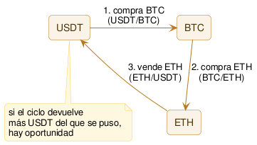

# Arbitraje triangular intra-exchange

Explotar una inconsistencia momentánea entre las cotizaciones de tres pares dentro del **mismo exchange** — un ciclo de tres operaciones que empieza y termina en el mismo activo, con ganancia si el ciclo no es exactamente neutro.

## Qué es

Un exchange lista muchos pares de forma independiente (ej. BTC/USDT, ETH/USDT, ETH/BTC). Estos tres mercados definen entre sí una [tasa cruzada](<../glosario.md#Tasa cruzada>) implícita: el precio de ETH en BTC debería poder derivarse combinando el precio de BTC en USDT y el de ETH en USDT. En condiciones normales las tres cotizaciones se mantienen consistentes entre sí — si no lo estuvieran, cualquiera podría convertir un activo en otro y de vuelta al original terminando con más de lo que empezó, sin haber tomado ninguna posición direccional. Cuando esa consistencia se rompe momentáneamente (por ejemplo, una orden grande en uno de los tres pares que mueve su precio antes de que los otros dos reaccionen), aparece la oportunidad: recorrer el ciclo completo en el orden que resulte rentable.

**Ejemplo ilustrativo** (números inventados, solo para mostrar el mecanismo — no son datos reales de mercado):
- BTC/USDT cotiza a 50.000 (comprar 1 BTC cuesta 50.000 USDT)
- ETH/BTC cotiza a 0,05 (comprar 1 ETH cuesta 0,05 BTC)
- ETH/USDT cotiza a 2.510 (vender 1 ETH da 2.510 USDT)

Ciclo: 50.000 USDT → compra 1 BTC → con ese BTC compra 20 ETH (1 ÷ 0,05) → vende esos 20 ETH a 2.510 cada uno → 50.200 USDT. Resultado: 200 USDT de ganancia bruta (0,4%) antes de [fees](../glosario.md#fees) — y hay que descontar los fees de **las tres** operaciones, no de una sola, además del [slippage](../glosario.md#slippage) de las tres.

A diferencia del [spot cross-exchange](01-spot-cross-exchange.md), acá **no hay ningún movimiento de fondos entre exchanges**: las tres operaciones ocurren en la misma cuenta, en el mismo exchange. Eso elimina por completo el [riesgo de custodia](<../glosario.md#Riesgo de custodia>) repartido en varios exchanges y la necesidad de capital pre-posicionado en múltiples lugares — todo el capital vive en un solo lugar, y las tres patas se ejecutan contra el mismo [order book](<../glosario.md#Order book>) que ya se está monitoreando de todas formas.

## Cómo funciona (diagrama)

## Estado actual y expectativas reales

El arbitraje triangular existe desde que hay libros de órdenes electrónicos, y en cierto sentido es más simple de detectar que el cross-exchange: las tres cotizaciones viven en el mismo exchange, sin necesidad de comparar datos de fuentes distintas con su propia latencia de red. Eso mismo lo hace un objetivo obvio — en los exchanges grandes, con miles de pares listados, hay tanto bots de terceros (es de las estrategias de arbitraje más documentadas públicamente, con cientos de implementaciones open-source apuntando a exchanges como Binance) como los propios market makers del exchange vigilando activamente que las tasas cruzadas de los pares más líquidos se mantengan consistentes. Ahí, cuando aparece una inconsistencia, se cierra en milisegundos.

Donde cambia el panorama es en exchanges medianos o chicos con muchos pares de altcoins listados (algo común, porque atrae volumen listar tokens chicos): más combinaciones posibles de triángulos, y menos bots sofisticados vigilando cada una. A diferencia del spot cross-exchange, acá la ventaja de operar en un exchange chico no viene acompañada del mismo costo — no hace falta fragmentar capital entre varios exchanges, porque todo el ciclo ocurre en una sola cuenta. Eso hace que el arbitraje triangular en exchanges chicos sea, en principio, operacionalmente más simple que el spot cross-exchange en el mismo tipo de exchange.

Expectativa realista: en pares grandes y exchanges grandes, cerrado por la misma razón que el spot cross-exchange — velocidad, no inteligencia. En exchanges chicos con muchos pares de altcoins, la hipótesis es más abierta, con la salvedad de que no todos los triángulos matemáticamente posibles tienen liquidez real en las tres patas a la vez — hay que filtrar por eso antes de asumir que "más pares" significa "más oportunidades".

## Riesgos propios

- **Slippage y fees compuestos en tres patas, no dos:** el margen ya es fino antes de fees; con tres operaciones en vez de dos, hay una pata más que puede salir peor de lo esperado.
- **Redondeo de [lote](../glosario.md#lote):** cada exchange redondea la cantidad operable a un incremento fijo. En un ciclo de tres patas, el redondeo se aplica tres veces — puede consumir buena parte de un margen ya fino, sobre todo si alguna de las patas tiene un lote grande en relación al tamaño de la operación.
- **Quedar atrapado a mitad de ciclo:** si el precio se mueve entre la pata 1 y la pata 2 (o la 2 y la 3), el bot puede terminar sosteniendo un activo intermedio (ej. BTC o ETH) a un precio que ya no conviene, en vez de completar el ciclo con ganancia. A diferencia del spot cross-exchange (donde una ejecución fallida deja una posición direccional en el activo original), acá siempre se termina sosteniendo *algún* activo del ciclo — sigue siendo una exposición no buscada.
- **[Rate limit](<../glosario.md#Rate limit>) de la API:** ejecutar tres órdenes casi simultáneas implica varias llamadas seguidas a la API del exchange. Si el rate limit demora una de ellas, la ventana de oportunidad puede cerrarse antes de completar el ciclo.
- **Menos triángulos líquidos de los que parece:** no toda combinación de tres pares que existe en el papel tiene profundidad real en las tres patas al mismo tiempo — hay que verificar liquidez real, no solo que el par exista.

## Hipótesis de vigencia hoy

**Convicción:** media

En exchanges grandes y pares líquidos, mismo diagnóstico que el spot cross-exchange: es un juego de velocidad de infraestructura, no de mejor lógica, y está cerrado para un bot independiente. En exchanges medianos/chicos con muchos pares de altcoins, la hipótesis es interesante y con un matiz a favor respecto al spot cross-exchange: no requiere fragmentar capital ni asumir riesgo de custodia en múltiples exchanges, todo el ciclo vive en una cuenta. Vale la pena testear en la Etapa 2 — priorizando exchanges con muchos pares listados y verificando primero cuáles triángulos tienen liquidez real en las tres patas antes de medir si la tasa cruzada se rompe con suficiente frecuencia y magnitud.
