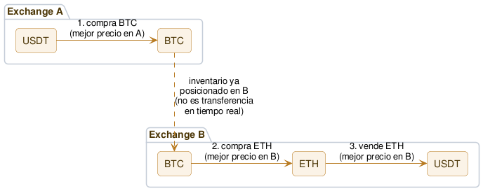

# Arbitraje triangular / multi-leg cross-exchange

Un ciclo de tres o más operaciones, como el [triangular intra-exchange](02-triangular-intra-exchange.md), pero repartido entre **distintos exchanges**: cada pata se ejecuta donde ya hay inventario posicionado y mejor precio, no necesariamente todas en el mismo lugar.

## Qué es

Es la combinación de las dos estrategias anteriores:

| | Patas | Exchanges | Activos |
| --- | :---: | :---: | :---: |
| [Spot cross-exchange](01-spot-cross-exchange.md) | 2 | 2 | 1 |
| [Triangular intra-exchange](02-triangular-intra-exchange.md) | 3 | 1 | 3 |
| **Triangular / multi-leg cross-exchange** | 3+ | 2+ | 3+ |

El mecanismo de base es el mismo que el triangular intra-exchange — un ciclo que vuelve al activo inicial, explotando que la [tasa cruzada](<../glosario.md#Tasa cruzada>) implícita entre varios pares no siempre coincide con la cotizada. La diferencia es que acá **cada pata se ejecuta en el exchange que convenga**, usando **capital pre-posicionado** (inventario del activo correspondiente ya disponible ahí, igual que en el spot cross-exchange, pero ahora de varios activos en varios exchanges a la vez) en vez de estar limitado a los pares de un único exchange.

Hay dos razones distintas para repartir las patas entre exchanges, y vale la pena distinguirlas:

1. **Por optimización.** Aunque los tres pares existan en un mismo exchange, puede convenir ejecutar una pata puntual en otro exchange porque ahí el precio es mejor — el desajuste que se explota no vive necesariamente todo en un solo lugar.
2. **Por necesidad.** A veces el ciclo completo **no existe** en ningún exchange individual — un exchange lista USDT/BTC y ETH/USDT pero no ETH/BTC directamente, por ejemplo. El triangular intra-exchange no puede operar ese ciclo bajo ninguna circunstancia; el cross-exchange sí, tomando la pata faltante de otro exchange que sí la lista.

**Una diferencia importante con las dos estrategias anteriores:** ahí la ganancia era literalmente el saldo que volvía a la cuenta al cerrar el ciclo. Acá, como las patas quedan repartidas entre exchanges, la ganancia se mide como el cambio en el **valor total del portafolio** sumado entre todos los exchanges usados — no es efectivo que "vuelve" a un único lugar. El exchange donde cae la última pata termina con más del activo de cotización, y otro exchange termina con menos de lo que gastó; si el ciclo fue rentable, la suma across todos los exchanges es mayor que al empezar, pero consolidarlo de nuevo en un solo lugar (si hiciera falta) requiere transferencias reales — el mismo rebalanceo periódico del spot cross-exchange, ahora sobre una matriz de varios activos en varios exchanges en vez de uno solo en dos.

## Cómo funciona (diagrama)

## Estado actual y expectativas reales

A nivel institucional, esto **sí** se opera activamente: firmas de trading cuantitativo multi-estrategia mantienen inventario e infraestructura de monitoreo across varios exchanges precisamente para este tipo de búsqueda combinatoria. No es un espacio vacío. Pero la naturaleza de la competencia es distinta a la de las dos estrategias anteriores: ahí ganaba quien fuera más rápido (colocation, infraestructura). Acá, con las patas repartidas en exchanges distintos que de por sí tienen latencias de red independientes, la velocidad pura importa menos — importa más **qué tan bien diseñada está la búsqueda**: qué ciclos se evalúan, en qué exchanges, con qué inventario disponible. Es un problema más de ingeniería/cobertura que de milisegundos.

Esa es también la razón por la que se priorizó esta hipótesis desde el principio: es la más compleja de construir bien, y por eso mismo la menos explorada por bots retail — la mayoría de los bots de arbitraje open-source implementan spot cross-exchange o triangular de un solo exchange, no la búsqueda combinada. Menos competencia retail no significa "sin competencia" (los actores institucionales sí están), pero sí significa que el criterio para competir se parece más a "cobertura y buen diseño" que a "quién tiene el mejor VPS".

Expectativa realista: el costo de esta ventaja es que **también multiplica** el riesgo de custodia del spot cross-exchange — ahora el capital está repartido en más exchanges, no menos, porque hace falta inventario de varios activos en cada uno de los exchanges que se quieran usar. Es la estrategia con más superficie de oportunidad del catálogo hasta ahora, pero también con más superficie de riesgo operativo — ninguna de las dos cosas se puede asumir sin medir.

## Riesgos propios

- **Todo lo de las dos estrategias base, combinado:** riesgo de custodia repartido (spot cross-exchange) y redondeo de lote / quedar atrapado a mitad de ciclo (triangular), ahora multiplicado por más exchanges y más activos en simultáneo.
- **Desincronización de datos entre exchanges:** los order books de cada exchange llegan con latencia de red distinta y no están perfectamente alineados en el tiempo — se puede estar comparando un precio "fresco" de un exchange contra uno ya desactualizado de otro, generando una oportunidad que parece existir en el cálculo pero ya no está disponible al intentar ejecutarla.
- **Gestión de inventario multi-exchange, multi-activo:** rebalancear deja de ser "mover un activo entre dos exchanges" y pasa a ser gestionar una matriz de varios activos en varios exchanges — decidir qué mover, cuándo, y por qué ruta, con sus propias fees de red en cada transferencia.
- **Espacio de búsqueda combinatorio:** con más exchanges y más pares, el número de ciclos posibles a evaluar crece rápido. Si el cálculo de qué ciclos son viables tarda más que la ventana de oportunidad, la detección no sirve de nada — el diseño de la búsqueda es en sí mismo parte del riesgo de ejecución.
- **[Rate limit](<../glosario.md#Rate limit>) multiplicado:** hay que respetar el límite de **cada** exchange usado, no solo uno.

## Hipótesis de vigencia hoy

**Convicción:** media-alta

Es la hipótesis más prometedora del catálogo hasta ahora — no porque el análisis técnico lo garantice (todavía no hay datos reales, como con las otras dos), sino porque la razón de la oportunidad no es "ser más rápido que un HFT" (ahí ya sabemos que se pierde) sino "cubrir y calcular mejor que la competencia retail actual", que es un terreno donde construir con cuidado sí puede importar. El costo es una complejidad de ejecución e infraestructura mayor que las otras dos estrategias, y un riesgo de custodia que crece con la cantidad de exchanges usados. Alta prioridad para testear en la Etapa 2, empezando por confirmar con datos reales si el espacio de ciclos "por necesidad" (pares que no coexisten en ningún exchange individual) es lo bastante frecuente como para justificar la complejidad adicional frente a simplemente hacer bien el triangular intra-exchange.
