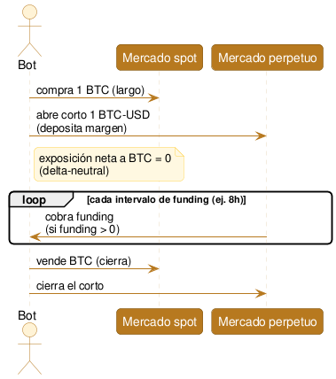

# Funding rate arbitrage (cash-and-carry)

Comprar el activo en [spot](../glosario.md#spot) y simultáneamente abrir una posición corta equivalente en su [contrato perpetuo](<../glosario.md#Perpetuo>), quedando sin exposición al precio ([delta-neutral](<../glosario.md#Delta-neutral>)), para cobrar el [funding rate](<../glosario.md#Funding rate>) que pagan los largos mientras se mantiene la posición.

## Qué es

A diferencia de las tres estrategias anteriores — que se ejecutan y cierran en segundos o minutos — esta se **mantiene abierta** durante horas, días o semanas, cobrando un pago periódico mientras dura. Es un cambio de naturaleza, no solo de mecánica.

Primero, el instrumento: un [contrato perpetuo](<../glosario.md#Perpetuo>) es un futuro sin fecha de vencimiento. Como no vence, no hay un evento que fuerce su precio a converger con el precio spot — para eso existe el [funding rate](<../glosario.md#Funding rate>): un pago que se hacen directamente entre sí (no con el exchange) quienes están en largo y quienes están en corto en ese perpetuo, cada cierto intervalo (típicamente 8 horas). Cuando el perpetuo cotiza por encima del spot — común en mercados alcistas, donde muchos quieren exposición larga apalancada — el funding es positivo y los largos pagan a los cortos, lo cual desincentiva ir largo y empuja el precio del perpetuo de vuelta hacia el spot.

La estrategia aprovecha eso directamente: si el funding es positivo, alguien que esté **corto** en el perpetuo cobra ese pago. Pero estar corto sin más es apostar a que el precio baje — expone a riesgo direccional. La jugada de cash-and-carry neutraliza ese riesgo:

1. Comprar el activo en spot (ej. 1 BTC) — posición larga.
2. Abrir en simultáneo una posición corta de tamaño equivalente en el perpetuo del mismo activo (ej. corto 1 BTC-USD perpetuo), depositando [margen](<../glosario.md#Margen>) para sostenerla.

El resultado es una posición combinada [delta-neutral](<../glosario.md#Delta-neutral>): si BTC sube, la spot gana lo que el corto pierde; si baja, es al revés. La exposición neta al precio es (idealmente) cero. Lo que queda es el funding: mientras la posición esté abierta y el funding sea positivo, se cobra en cada intervalo — es un rendimiento que no depende de acertar la dirección del mercado.

## Cómo funciona (diagrama)

## Estado actual y expectativas reales

Esta estrategia es distinta a las tres anteriores en un sentido importante: no es un hueco poco conocido — es, probablemente, la estrategia de "rendimiento neutral al mercado" más conocida y más usada en cripto. La mayoría de los productos de "yield" o "ingresos pasivos" que ofrecen los exchanges y plataformas de productos estructurados son, por debajo, alguna variante de este mismo cash-and-carry empaquetada para quien no quiere operarlo manualmente. Eso significa que hay capital institucional grande haciendo exactamente esto a escala, lo cual comprime el funding rate cuando está muy atractivo (más gente corta el perpetuo para cobrar el funding → esa misma presión empuja el precio del perpetuo hacia abajo → el funding baja).

La diferencia real frente al spot cross-exchange y el triangular es **el tipo de competencia**: ahí se compite por velocidad (milisegundos). Acá el funding se liquida en intervalos de horas, no de milisegundos — no hace falta ser el más rápido, hace falta identificar correctamente cuándo el funding es lo bastante atractivo como para justificar los costos y riesgos de mantener la posición, y gestionar bien esa posición mientras dura. Es un juego de timing y de gestión de riesgo, no de infraestructura.

Por eso la pregunta relevante para este proyecto no es "¿existe esta estrategia?" (sí, es pública y bien documentada) sino **"¿construir esto da una ventaja real sobre simplemente usar un producto ya armado que hace lo mismo?"** — una pregunta distinta a la de las estrategias anteriores, donde se buscaba una ineficiencia que nadie más estuviera explotando. Acá se trataría más bien de: ejecutarlo con mejor gestión de riesgo, en mejores ventanas de tiempo, o en pares/exchanges que los productos empaquetados no cubren.

## Riesgos propios

- **Riesgo de liquidación en el corto:** la posición en el perpetuo está apalancada. Si el precio sube fuerte y el margen no alcanza para cubrir la pérdida no realizada, el exchange fuerza el cierre ([liquidación](<../glosario.md#Liquidación>)) antes de que se decida cerrarla — con una penalización adicional. La pata spot seguiría ganando, pero si el corto se liquida, la cobertura desaparece y queda una exposición direccional no buscada.
- **Riesgo de que el funding se invierta:** el funding no es fijo. Puede volverse negativo mientras la posición está abierta — ahí se empieza a *pagar* en vez de cobrar. Sin un criterio claro de cuándo salir, un funding negativo sostenido convierte la estrategia en un costo neto.
- **Riesgo de base:** el precio del perpetuo y el del spot no están perfectamente pegados todo el tiempo — pueden divergir, sobre todo en momentos volátiles o si el spot y el perpetuo se operan en exchanges distintos. La cobertura delta-neutral es una aproximación, no una garantía absoluta de exposición cero.
- **Riesgo de custodia, con más tiempo de exposición:** a diferencia de las estrategias anteriores (segundos o minutos), acá el capital queda depositado y margen abierto durante horas, días o semanas — más tiempo de exposición a que el exchange congele retiros, sea hackeado, o entre en problemas de solvencia.
- **Capital inmovilizado en margen:** mantener un margen conservador (para alejarse del riesgo de liquidación) inmoviliza más capital del estrictamente necesario, lo cual reduce el rendimiento anualizado real de la estrategia frente al funding "bruto" cobrado.

## Hipótesis de vigencia hoy

**Convicción:** media

No hay duda de que la estrategia existe y funciona — la duda no es esa. La pregunta abierta es si vale la pena construirla desde cero para este proyecto en vez de reconocerla como una herramienta ya resuelta por el mercado (productos de yield existentes), y si al construirla propia hay ventaja real en gestión de riesgo, timing de entrada/salida, o cobertura de pares/exchanges que esos productos no atienden. Vale la pena testear en la Etapa 2 con datos reales de funding histórico — no para confirmar que "hay funding positivo alguna vez" (lo hay), sino para medir con qué frecuencia y magnitud, y si el rendimiento neto de costos de margen y riesgo de liquidación justifica construir esto en vez de usar lo que ya existe.
