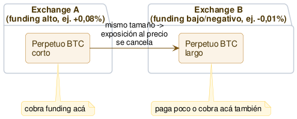

# Funding rate cross-exchange

Explotar la diferencia de [funding rate](<../glosario.md#Funding rate>) del mismo activo entre dos exchanges: corto en el perpetuo del exchange que paga más, largo en el perpetuo del exchange que paga menos (o cobra), quedando [delta-neutral](<../glosario.md#Delta-neutral>) y cobrando la diferencia.

## Qué es

Cada exchange calcula su propio funding de forma independiente — no existe un funding único, global, para un activo. Es el resultado del desajuste entre **su** perpetuo y **su** índice, y ese desajuste depende de la base de usuarios de cada exchange: cuánta gente ahí quiere estar larga o corta apalancada. Como esa demanda no es la misma en todos lados, el funding del mismo activo (ej. BTC) puede diferir bastante entre Exchange A y Exchange B en el mismo momento — a veces incluso con signo contrario: uno positivo, otro negativo.

La diferencia con [cash-and-carry](04-funding-rate-cash-and-carry.md) está en cómo se cubre el perpetuo. Ahí se cubría con [spot](../glosario.md#spot) del mismo activo. Acá se cubre con **otro perpetuo del mismo activo, en otro exchange**:

1. Corto en el perpetuo del exchange con funding más alto — para cobrarlo.
2. Largo en el perpetuo del exchange con funding más bajo (o negativo) — para pagar poco, o cobrar ahí también.

Con el mismo tamaño en las dos patas, la exposición al precio del activo se cancela igual que en cash-and-carry — solo que ahora **las dos patas son derivados**, ninguna es spot. Lo que queda es el **diferencial de funding** (fundingA − fundingB), cobrado en cada intervalo, sin apostar a la dirección del precio.

Esto retoma el carácter cross-exchange que cash-and-carry no tenía — esa se podía hacer completa en un solo exchange; esta necesita, por diseño, dos.

## Cómo funciona (diagrama)

## Estado actual y expectativas reales

Es una estrategia real y conocida entre fondos cuantitativos market-neutral — no es un hueco escondido, en ese sentido se parece a cash-and-carry. Pero requiere más infraestructura que operar en un solo exchange: cuentas, margen y monitoreo en al menos dos lugares a la vez, en simultáneo. Eso probablemente reduce algo la competencia retail frente al cash-and-carry de un solo exchange (que cualquiera puede hacer con una sola cuenta), aunque no tanto como para asumir que es un espacio libre — los mismos fondos que hacen cash-and-carry a escala también vigilan diferenciales entre exchanges.

Hay una razón estructural para esperar que el diferencial exista con cierta frecuencia: los exchanges no comparten base de usuarios, así que su demanda de largos/cortos apalancados no tiene por qué estar sincronizada. Es una hipótesis razonable, no una certeza — hay que medir cuán seguido el diferencial supera los costos de operar en dos lugares a la vez.

## Riesgos propios

- **Doble riesgo de liquidación:** a diferencia de cash-and-carry (donde solo la pata del perpetuo era liquidable, la spot no), acá **las dos patas son perpetuos apalancados** — cada una puede liquidarse por su cuenta, en exchanges distintos.
- **Correlación imperfecta entre exchanges:** los dos perpetuos deberían moverse casi igual (ambos anclados al mismo activo), pero no son el mismo instrumento — pueden divergir entre sí más de lo que un perpetuo diverge de su propio spot, sobre todo en momentos de estrés o baja liquidez en alguno de los dos.
- **[Riesgo de custodia](<../glosario.md#Riesgo de custodia>) multiplicado:** margen depositado en dos exchanges distintos, cada uno con su propio riesgo de exchange.
- **El funding de cada lado puede moverse por separado:** la ventaja que motivó abrir la posición puede angostarse o invertirse en cualquiera de los dos exchanges de forma independiente, no solo en conjunto.
- **[Rate limit](<../glosario.md#Rate limit>) multi-exchange:** gestionar dos posiciones apalancadas en simultáneo, en dos exchanges, con sus propios límites de API cada uno.

## Hipótesis de vigencia hoy

**Convicción:** media

Como cash-and-carry, la pregunta no es "¿existe?" (existe, y hay actores serios haciéndolo), sino si el diferencial es lo bastante frecuente y grande como para justificar el doble riesgo de liquidación y la infraestructura de dos exchanges. Vale la pena testear en la Etapa 2 con datos históricos de funding real de varios exchanges — midiendo cuán seguido el diferencial supera los costos combinados de mantener ambas patas, no solo si alguna vez aparece.
