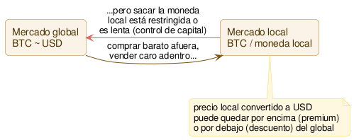

# Premium regional / fiat

Comparar el precio de un activo (típicamente BTC o un stablecoin) expresado en una moneda local, contra su precio de referencia internacional convertido a esa misma moneda — y explotar la diferencia cuando el mercado local cotiza sistemáticamente más caro (o más barato) que el resto del mundo.

## Qué es

Hasta acá, todas las estrategias del catálogo comparaban cripto contra cripto, o cripto contra su propio derivado. Esta es distinta: compara el precio de un activo **expresado en una moneda local** (ej. BTC/CLP, BTC/ARS, BTC/KRW) contra el precio internacional de ese mismo activo (ej. BTC/USDT en un exchange global), convertido a esa moneda local con el tipo de cambio real de mercado.

Si BTC vale US$ 65.000 en el mercado global, y el dólar oficial cotiza a $950 CLP, el precio "justo" de BTC en pesos chilenos sería ~$61.750.000 CLP. Si un exchange local lo cotiza bastante por encima de eso, hay una **prima regional** (premium); si cotiza por debajo, un **descuento**. La jugada teórica: comprar el activo donde está barato, moverlo (o su valor) adonde está caro, vender, y convertir de vuelta — capturando la diferencia.

**Por qué esto es distinto a todo lo anterior:** en las estrategias 01-05, la razón por la que el spread no se cierra solo es la velocidad — hay que ganarle a otros bots en milisegundos. Acá la razón suele ser otra completamente distinta: **[controles de capital](<../glosario.md#Control de capital>)**. Algunos países restringen cuánta moneda local se puede convertir o sacar del país, o hacen el trámite lento y burocrático. Eso frena el arbitraje no porque falte tecnología, sino porque mover el dinero de un lado a otro tiene un límite legal o un cuello de botella bancario. Por eso estas primas pueden durar semanas o meses, no milisegundos — es el ejemplo histórico más conocido, el "kimchi premium" en Corea, documentado desde hace años.

## Cómo funciona (diagrama)

## Estado actual y expectativas reales

Es real y está documentado: el "kimchi premium" coreano ha llegado a superar el 20-50% en momentos de mucha demanda local. Argentina y Venezuela tuvieron primas significativas en sus propias crisis cambiarias — en Argentina, además, conviven varios tipos de cambio a la vez (oficial, "blue", MEP, CCL), y el precio del cripto local suele referenciarse contra el paralelo, no el oficial, lo cual agrega una capa más de complejidad al cálculo de "cuál es el precio justo".

El matiz importante, y el más distinto de todo el catálogo: **la prima suele existir precisamente donde es más difícil operarla desde afuera.** Muchos de los exchanges donde aparece la prima más jugosa exigen cuenta bancaria y verificación de residente local — no son mercados abiertos a cualquiera con una API key, como sí lo son los exchanges globales de las estrategias anteriores. El acceso real es una precondición, no un detalle.

De hecho ya tenemos una medición propia sobre esto: cuando comparamos USDT/CLP entre BudaPRO y NotBank, no encontramos ninguna prima — los libros estaban consistentes entre sí (ver conversación de esta etapa). Consistente con que Chile no tiene controles de capital fuertes como los de Argentina o Venezuela — el mercado acá parece razonablemente eficiente para esta pregunta puntual. Si esta hipótesis tiene mérito, probablemente no sea en el mercado local disponible hoy, sino en corredores con fricción cambiaria más fuerte — que traen la limitación de acceso ya mencionada.

## Riesgos propios

- **Riesgo regulatorio, no de mercado:** los controles de capital pueden endurecerse de un día para el otro — un límite que hoy permite operar puede desaparecer mañana. Es un riesgo país, distinto en naturaleza a todo lo visto antes en el catálogo.
- **Acceso limitado a residentes locales:** varios de los mercados con la prima más conocida requieren cuenta bancaria y KYC del país — no alcanza con abrir una cuenta de exchange y una API key.
- **Tiempo de captura largo:** mover capital por los canales permitidos puede tomar días o semanas, exponiendo a que la prima se cierre o revierta antes de completar el ciclo — muy distinto a la ejecución de segundos de las estrategias 01-03.
- **Riesgo de contraparte del exchange local:** los exchanges regionales chicos pueden tener menor solvencia o marco regulatorio más débil que los grandes globales.
- **Riesgo cambiario en la conversión de vuelta:** si hay que pasar por un mercado paralelo para reconvertir a la moneda de origen, ese tipo de cambio tiene su propio spread y también se mueve.

## Hipótesis de vigencia hoy

**Convicción:** baja-media

La prima existe y está bien documentada en algunos países — pero la medición propia que ya hicimos en el mercado disponible hoy (Chile, USDT/CLP) no mostró nada. Si se quiere seguir esta hipótesis, la pregunta previa no es "¿hay prima?" sino **"¿tenemos manera real de acceder a un corredor donde sí la haya?"** — sin cuenta bancaria y residencia en un país con controles de capital activos, esta estrategia queda fuera de alcance práctico, sin importar cuán grande sea la prima en el papel. Vale la pena dejarla documentada por completitud del catálogo, pero es la primera candidata a **descartar** en la síntesis de la Etapa 1 si no aparece un corredor realmente accesible.
