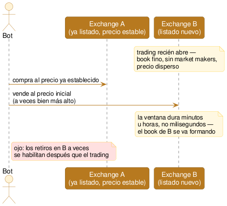

# Arbitraje de nuevo listado

Cuando un activo que ya cotiza en un exchange se lista de nuevo en otro, el precio inicial en el exchange nuevo suele estar desalineado del precio ya establecido — porque el book recién se está formando. Comprar donde está el precio establecido, vender donde está la desalineación inicial, mientras dura.

## Qué es

Es una variante de [spot cross-exchange](01-spot-cross-exchange.md), pero con un disparador puntual: un listado nuevo. La diferencia clave con el spot cross-exchange "de todos los días" es el **origen** del spread. Ahí, el spread aparece y se cierra en milisegundos porque el mercado ya es líquido y eficiente en ambos lados. Acá, el spread aparece porque uno de los dos lados es **nuevo**: el [order book](<../glosario.md#Order book>) recién se está formando, sin [market makers](<../glosario.md#Market maker>) establecidos todavía, así que el precio inicial puede desviarse bastante del precio ya asentado en otro exchange donde el activo cotiza hace tiempo.

Esto **solo aplica a activos que ya cotizan en algún lado** — si es la primerísima vez que un token opera en cualquier mercado (ej. el lanzamiento de un proyecto nuevo), no hay un precio de referencia contra el cual arbitrar: eso es descubrimiento de precio puro, no arbitraje. El caso que importa acá es: activo ya establecido en el Exchange A, listado nuevo en el Exchange B.

Un matiz operativo importante: muchos exchanges habilitan el trading de un listado nuevo **antes** que los retiros — es una práctica común para evitar que el precio se desplome apenas abre por gente vendiendo lo que recién depositó. Eso significa que, aunque compres barato y "captures" el spread comprando en A y vendiendo en B, si el plan dependía de mover el activo hacia B, podés quedar con retiros bloqueados un rato — atrapado del lado equivocado, sin poder completar el ciclo cuando querías.

## Cómo funciona (diagrama)

## Estado actual y expectativas reales

Es real y bien conocida — los anuncios de listado de exchanges grandes (Binance, Coinbase) mueven precio de inmediato, y hay bots dedicados específicamente a vigilar esos anuncios y dispararse apenas abre el trading. En ese segmento (listados de exchanges grandes, activos ya conocidos) la competencia es alta y sofisticada, similar a lo que vimos en spot cross-exchange.

Hay un matiz que la distingue de la 01 en algo a favor: la ventana no es de milisegundos. Como el book nuevo tarda minutos u horas en formarse de verdad (no segundos), incluso un operador que no gana la carrera de los primeros instantes puede llegar a capturar parte de la cola de la desalineación — algo que en el spot cross-exchange de todos los días, cerrado en milisegundos, no aplica. Los exchanges chicos, que listan con más frecuencia y menos infraestructura de market-making, probablemente sean el segmento con más margen — con la salvedad de que el activo en sí suele ser más chico y más riesgoso.

## Riesgos propios

- **No hay nada que arbitrar si el activo es genuinamente nuevo:** sin un precio ya establecido en otro lado, esto deja de ser arbitraje y pasa a ser apostar a un precio que se está descubriendo — un juego completamente distinto, mucho más especulativo.
- **Retiros bloqueados temporalmente:** como se explicó arriba, quedar con el activo comprado en el exchange nuevo sin poder retirarlo todavía — un análogo, más chico y temporal, al riesgo de [control de capital](<../glosario.md#Control de capital>) que vimos en la estrategia anterior.
- **Slippage e iliquidez extremos:** el book recién formándose es mucho más fino que el de un par ya maduro — el spread que se ve puede no sobrevivir a la ejecución real, con el mismo problema que ya vimos pero amplificado.
- **[Wash trading](<../glosario.md#Wash trading>):** en listados nuevos de exchanges chicos, es común que el proyecto o el mismo exchange infle artificialmente el volumen o el precio inicial para generar atención — el "precio" que se observa puede no reflejar demanda real.
- **Requiere vigilancia activa de anuncios:** a diferencia de las estrategias anteriores (que monitorean pares que ya existen), esto necesita enterarse de listados *antes* de que abran, en varios exchanges a la vez — una tarea de información, no solo de ejecución.
- **Reglas especiales al inicio:** algunos exchanges limitan el tamaño de orden o pausan el trading en los primeros minutos de un listado específicamente para frenar la volatilidad — puede bloquear el tamaño que se quería operar.

## Hipótesis de vigencia hoy

**Convicción:** media

Comparte con el spot cross-exchange el problema de fondo (competencia sofisticada en los listados de exchanges grandes), pero la ventana más larga (minutos/horas, no milisegundos) la hace algo más accesible que la 01 en su versión de todos los días. El riesgo de retiros bloqueados y wash trading son propios de esta estrategia y hay que medirlos aparte. Vale la pena testear en la Etapa 2 acotado a activos que ya cotizan en algún exchange grande y se listan de nuevo en uno chico — no a lanzamientos de proyectos nuevos, que es una apuesta distinta.
