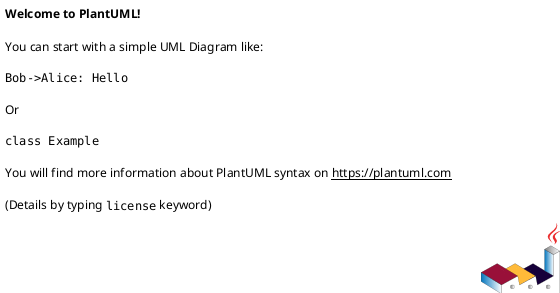

> Plantilla de documento de estrategia (archivo único). Copiar a `<nombre-en-kebab-case>.md`, completar y borrar esta línea.
> Para cambiar el formato, **editá esta plantilla directamente** — git guarda el historial.
> Objetivo del documento: que alguien sin conocimiento previo de trading/cripto entienda **exactamente** cómo funciona la estrategia. Todo término no obvio va al [glosario](../glosario.md) — acá se linkea (`[order book](../glosario.md#order-book)`), no se reexplica.
> **General y atemporal:** describe la estrategia y el estado del mercado, no experiencias personales ni anécdotas — esas viven en la conversación, no en el documento (ver [metodologia.md](../metodologia.md)).

# Nombre de la estrategia

Resumen en una línea: qué es y de dónde sale la ganancia.

## Qué es

Explicación mecánica, paso a paso: qué se compra, qué se vende, en qué orden, con qué instrumentos, y de dónde sale exactamente la ganancia. Sin asumir que quien lee ya sabe de trading — cada término no obvio linkea al [glosario](../glosario.md).

## Cómo funciona (diagrama)

## Estado actual y expectativas reales

Quién opera esto hoy (tipo de actor: institucional/HFT vs. independiente), qué tan comprimido está el margen, en qué segmento del mercado (si en alguno) sigue habiendo espacio para alguien construyendo esto de cero, sin ventaja institucional. Expectativa realista, no optimista ni pesimista de entrada — lo que indique la estructura del mercado.

## Riesgos propios

No solo "puede no haber ganancia" — qué puede salir mal **específicamente** en esta estrategia (ej. slippage en una pata, liquidación de una posición apalancada, congelamiento de retiro en un exchange chico, etc.).

## Hipótesis de vigencia hoy

**Convicción:** alta / media / baja

¿Vale la pena testear esta hipótesis con datos reales en la Etapa 2? ¿Dónde específicamente (qué tipo de exchange, qué tipo de par)? El porqué de la convicción.
