# Metodología de Trabajo — Cryptobot

Cómo trabajamos en Cryptobot, para que ninguna sesión tenga que reinventar la forma. Si [vision.md](vision.md) es el norte y [roadmap.md](roadmap.md) las etapas, este documento es el **motor**: el ciclo de trabajo, las convenciones y el formato de los documentos.

## Principio: documentación-driven

Cryptobot se construye con documentos vivos como espina dorsal. Antes de ejecutar, se define; después de ejecutar, se cierra. La documentación no es un extra al final: es parte del ciclo. Una tarea no está completa si dejó documentación desactualizada.

## El ciclo de sprints

Un **sprint** es un paso mínimo que agrega valor visible y entrega algo demoable. Los sprints son pequeños a propósito: complejidad incremental, lo simple primero.

### Ritual de inicio de sesión
Cada sesión arranca con dos preguntas:
1. **¿Qué funciona hoy?**
2. **¿Qué quedó pendiente?**

Con esa base se propone el **siguiente paso mínimo** que agregue valor visible. Nunca se asume el plan: se reconstruye desde lo que realmente funciona.

### Definir un sprint
Antes de escribir código se crea `sprints/sprint_NNNN.md` copiando la **plantilla** [`sprints/_plantilla-sprint.md`](sprints/_plantilla-sprint.md) (archivo único; para cambiar el formato se edita directamente y git guarda el historial). El sprint declara su objetivo, su alcance, lo que queda fuera, y el Sprint Review (cómo se prueba el incremento y qué debe cumplir). Las decisiones de stack/herramientas/exchanges/APIs se proponen aquí, just-in-time, con su porqué.

### Ejecutar
Código limpio y modular desde el día 1. Se actualizan los docs afectados en el mismo movimiento, no después.

### Definition of Done (un sprint está cerrado cuando)
- [ ] Entrega algo que **funciona** y se puede demostrar.
- [ ] El Sprint Review pasa: el incremento se puede probar y cumple lo definido.
- [ ] El código está limpio y commiteado.
- [ ] **Revisión de código:** Marcelo revisó el código generado (es autogenerado — no se cierra sin revisar).
- [ ] Los docs afectados (sprint, roadmap, hub) quedan actualizados.
- [ ] El PR del sprint se mergeó a `master` (merge commit) y se borró la rama.
- [ ] Se anota qué quedó pendiente / qué sigue.

## Convenciones

- **Idioma:** documentos y comunicación del proyecto en español. **Todo lo que no es interacción con el usuario va en inglés** (nombres, comentarios, docstrings). En español solo lo que el usuario **ve o escucha** (si el bot llega a tener alguna interfaz).
- **Nombres de archivo:** `kebab-case` (ej: `roadmap.md`). Excepción: los sprints usan `sprint_NNNN.md`.
- **Numeración de sprints:** 4 dígitos con cero a la izquierda — `sprint_0001.md`, `sprint_0042.md`.
- **Links entre documentos:** cuando un documento referencia a otro, se usa un **enlace markdown** real con ruta relativa — `[roadmap.md](roadmap.md)`, no solo el nombre entre comillas invertidas ni `[[wikilinks]]`. Así el lector navega de un doc a otro con un clic, igual en Obsidian y en Quartz.
- **Frontmatter:** los meta-docs (`vision`, `roadmap`, `metodologia`, `hub`) van **sin** frontmatter. Los **sprints sí** llevan frontmatter (`sprint`, `titulo`, `etapa`) para poder listarlos. El **estado** del sprint no va en el frontmatter — vive solo en el roadmap (única fuente, para no desincronizar).
- **Historial:** vive en git (`git log`, `git blame`). Sin changelog manual dentro de los documentos.
- **Commits y push:** **siempre requieren autorización explícita de Marcelo.** No hacer `git commit` ni `git push` sin que él lo pida.
- **Capital real:** ninguna decisión que involucre fondos reales (crear cuentas, generar API keys con permisos de trading, mover capital) se ejecuta sin autorización explícita y sin haber pasado antes por simulación/paper trading — ver [roadmap.md](roadmap.md).
- **Entorno y herramientas:** cuando se adopta una herramienta, lenguaje, exchange o servicio, se registra en [entorno.md](entorno.md) — el inventario vivo de qué usamos y cómo, para no re-investigar.

## Ramas (git)

En esta etapa el proyecto lo construye solo Marcelo, así que **nada de GitFlow** ni flujos pesados — un modelo simple:

- **`master`** es la rama estable: siempre debe quedar demoable.
- **Una rama por sprint:** `sprint/000N-nombre-en-kebab-case` (ej: `sprint/0001-deteccion-basica`). El `/` separa el espacio de nombres; el nombre va en `kebab-case`.
- **Flujo:** al iniciar el sprint se crea la rama desde `master` → se trabaja ahí (commits + push) → al cerrarlo (cumple el Definition of Done) se abre un **PR a `master`**, se revisa, y se **mergea con _merge commit_** (equivale a `--no-ff`: deja el sprint como un punto visible en el historial) y se borra la rama.
- **Lo que NO es trabajo de un sprint** (ajustes a meta-docs: visión, roadmap, metodología, hub, entorno, README) va **directo a `master`**, sin rama.
- Commits y push siguen requiriendo autorización de Marcelo (ver Convenciones).

## Diagramas (PlantUML)

Cuando un diagrama aclara más que el texto, se usa un bloque PlantUML con el **Estilo Cryptobot** — la paleta y tipografía común del proyecto (ámbar `#B7791F`, fuente FreeSans), renderizado vía Kroki (`localhost:18000`) igual que en los demás proyectos (pipeline documentado en `quartz-setup` dentro del vault de Obsidian). Sirve para secuencia, actividad, rectángulos y notas.

**Este proyecto se apoya bastante en diagramas** — ante la duda, conviene tenerlo: etapas, flujos de decisión, arquitectura de datos, todo lo que ayude a ver de un vistazo cómo encajan las piezas.

El estilo canónico vive en [cryptobot-style.puml](_assets/cryptobot-style.puml). **Cada diagrama lo lleva como encabezado**: copiar ese bloque justo después de `@startuml`.

````markdown

```plantuml
@startuml
' --- Estilo Cryptobot: pegar el bloque de _assets/cryptobot-style.puml ---
A -> B : hola
@enduml
```

````

> **¿Por qué copiar y no `!include`?** El Kroki local corre con `KROKI_SAFE_MODE=secure`, que **bloquea los includes** (de archivo y de URL). Por eso cada diagrama copia el bloque, y [cryptobot-style.puml](_assets/cryptobot-style.puml) es la referencia/única fuente del estilo. Es lo más simple y funciona en Kroki, Obsidian (plugin `obsidian-kroki`) y Quartz.

## Estructura documental

El índice de qué hace cada documento vive en [hub.md](hub.md) (para no duplicarlo). Aquí solo la regla de organización:

**Crear carpetas nuevas solo cuando hay contenido real para poner.** No anticipar estructura vacía — sin over-engineering, también en los docs.

## Principios de documentación

1. **Documentos vivos** — nada es definitivo; se actualizan cuando la realidad cambia.
2. **Sin redundancia** — cada idea en un solo lugar; los docs apuntan, no copian.
3. **Single source of truth** — el doc registra el qué y el porqué, no reproduce lo que puede verse en su fuente (código, configuración).
4. **El historial vive en git** — sin changelog manual ni sello de versión en el cuerpo del documento.
5. **General y atemporal** — el doc describe la capacidad técnica, no casos personales ni anécdotas. Esos detalles viven en la conversación, no en la documentación.
