# Roadmap — Etapas y sprints

> **Este documento se mantiene deliberadamente simple y general.** El roadmap es vivo: no está planificado por completo de antemano, se construye a medida que avanzamos. Por eso aquí **no van costos, métricas ni detalle fino** — el *porqué* vive en [vision.md](vision.md) y el detalle de ejecución en cada `sprints/sprint_NNNN.md`. Mantenerlo así evita duplicar información y que el roadmap se desincronice. Aquí solo: las etapas como dirección, y los sprints ubicados bajo su etapa con su estado.

## Las etapas

De la investigación a la evidencia. No saltamos etapas — la 3 no se abre si la 2 no da señal positiva.

```plantuml
@startuml
' --- Estilo Cryptobot (ver _assets/cryptobot-style.puml) ---
skinparam backgroundColor #FFFFFF
skinparam defaultFontName "FreeSans"
skinparam shadowing false
skinparam roundCorner 10
skinparam ArrowColor #B7791F
skinparam rectangle {
  BackgroundColor #FBF3E7
  BorderColor #B7791F
  FontColor #4A3403
}
' -------------------------------------------------
rectangle "Etapa 1\nEstado del arte" as E1
rectangle "Etapa 2\nAnálisis de viabilidad" as E2
rectangle "Etapa 3\n(pendiente)" as E3
E1 -right-> E2
E2 -right-> E3
@enduml
```

| Etapa | Qué es | Evaluar pasar a la siguiente cuando… |
| :--- | :--- | :--- |
| **1 — Estado del arte** | Catálogo de estrategias de arbitraje cripto (la que ya vivió Marcelo hace ~10 años + las que aparecieron después: triangular cross-exchange, funding rate, premium regional, etc.), qué cambió en el mercado desde entonces, e hipótesis de dónde puede quedar edge hoy. Sin código, sin conectarse a ningún exchange. | El catálogo está completo y salen 2-3 hipótesis concretas y priorizadas, listas para testear con datos reales. |
| **2 — Análisis de viabilidad** | Herramientas de **solo lectura** (APIs públicas de mercado, sin cuentas ni permisos de trading, sin capital) que capturan datos reales — order books, funding rates — en un grupo de exchanges (algunos "majors" de control + chicos/regionales) y miden si las hipótesis de la Etapa 1 se sostienen neto de fees y slippage. | Cada hipótesis priorizada tiene un veredicto documentado con datos: señal real o descartada. |
| **3 — (pendiente)** | Se define **solo si** la Etapa 2 muestra señal positiva en al menos una hipótesis. No se decide de antemano qué es — podría ser paper trading, podría ser profundizar en la hipótesis ganadora. | — es la salida de la Etapa 2, no tiene criterio propio todavía. |

> **Capital real:** no se abre ni se evalúa antes de la Etapa 3, y ni ahí sin autorización explícita — ver [metodologia.md](metodologia.md).

## Sprints

Cada sprint se agrupa bajo su etapa. El detalle de cada uno vive en su archivo; aquí solo el estado. Las etapas aparecen acá a medida que tienen sprints.

### Etapa 1 — Estado del arte

| Sprint | Objetivo | Estado |
| :---: | :--- | :--- |
| [`0001`](sprints/sprint_0001.md) | Estado del arte y catálogo de hipótesis | 📝 Planificado |

### Etapa 2 — Análisis de viabilidad

_(sin sprints todavía — se definen al cerrar el `0001`, cuando sepamos qué hipótesis quedaron priorizadas)_

### Estados

| Estado | Significado |
| :--- | :--- |
| 📝 **Planificado** | Definido, aún no comienza |
| 🔵 **En curso** | En ejecución |
| ✅ **Cerrado** | Terminado y demostrado |
| ⏸️ **Pausado** | Detenido temporalmente |

> Plantilla para sprints nuevos: [_plantilla-sprint.md](sprints/_plantilla-sprint.md) (archivo único; para cambiar el formato se edita directamente y git guarda el historial).

## Backlog técnico (no priorizado)

Cosas que sabemos que hay que hacer pero que **no son un sprint todavía**: mejoras, deuda técnica o ideas que esperan su momento. No tienen orden ni fecha; cuando una se vuelve relevante, se convierte en (o se suma a) un sprint. Vive acá para **no perderse**.

_(vacío por ahora)_
