# Roadmap — Etapas y sprints

> **Este documento se mantiene deliberadamente simple y general.** El roadmap es vivo: no está planificado por completo de antemano, se construye a medida que avanzamos. Por eso aquí **no van costos, métricas ni detalle fino** — el *porqué* vive en [vision.md](vision.md) y el detalle de ejecución en cada `sprints/sprint_NNNN.md`. Mantenerlo así evita duplicar información y que el roadmap se desincronice. Aquí solo: las etapas como dirección, y los sprints ubicados bajo su etapa con su estado.

## Las etapas

De la investigación a la evidencia. No saltamos etapas — la 3 no se abre si la 2 no da señal positiva.

```plantuml
@startuml
' --- Estilo Cryptobot (ver _assets/cryptobot-style.puml) ---
skinparam backgroundColor #FFFFFF
skinparam defaultFontName "FreeSans"
skinparam shadowing false
skinparam roundCorner 10
skinparam ArrowColor #B7791F
skinparam rectangle {
  BackgroundColor #FBF3E7
  BorderColor #B7791F
  FontColor #4A3403
}
' -------------------------------------------------
rectangle "Etapa 1\nEstado del arte" as E1
rectangle "Etapa 2\nAnálisis de viabilidad" as E2
rectangle "Etapa 3\n(pendiente)" as E3
E1 -right-> E2
E2 -right-> E3
@enduml
```

| Etapa | Qué es | Evaluar pasar a la siguiente cuando… |
| :--- | :--- | :--- |
| **1 — Estado del arte** | Catálogo de estrategias de arbitraje cripto (la que ya vivió Marcelo hace ~10 años + las que aparecieron después: triangular cross-exchange, funding rate, premium regional, etc.), qué cambió en el mercado desde entonces, e hipótesis de dónde puede quedar edge hoy. Sin código, sin conectarse a ningún exchange. | El catálogo está completo y salen 2-3 hipótesis concretas y priorizadas, listas para testear con datos reales. |
| **2 — Análisis de viabilidad** | Herramientas de **solo lectura** (APIs públicas de mercado, sin cuentas ni permisos de trading, sin capital) que capturan datos reales — order books, funding rates — en un grupo de exchanges (algunos "majors" de control + chicos/regionales) y miden si las hipótesis de la Etapa 1 se sostienen neto de fees y slippage. | Cada hipótesis priorizada tiene un veredicto documentado con datos: señal real o descartada. |
| **3 — (pendiente)** | Se define **solo si** la Etapa 2 muestra señal positiva en al menos una hipótesis. No se decide de antemano qué es — podría ser paper trading, podría ser profundizar en la hipótesis ganadora. | — es la salida de la Etapa 2, no tiene criterio propio todavía. |

> **Capital real:** no se abre ni se evalúa antes de la Etapa 3, y ni ahí sin autorización explícita — ver [metodologia.md](metodologia.md).

## Sprints

Cada sprint se agrupa bajo su etapa. El detalle de cada uno vive en su archivo; aquí solo el estado. Las etapas aparecen acá a medida que tienen sprints.

### Etapa 1 — Estado del arte

|              Sprint              | Objetivo                                | Estado      |
| :------------------------------: | :-------------------------------------- | :---------- |
| [`0001`](sprints/sprint_0001.md) | Estado del arte y catálogo de hipótesis | ✅ Cerrado |

### Etapa 2 — Análisis de viabilidad

|              Sprint              | Objetivo                                                       | Estado         |
| :------------------------------: | :--------------------------------------------------------------| :------------- |
| [`0002`](sprints/sprint_0002.md) | Primer conector de solo lectura y validación de spread real    | ✅ Cerrado      |
| [`0003`](sprints/sprint_0003.md) | Monitoreo continuo con registro (SpreadWatcher)                | ✅ Cerrado      |
| [`0004`](sprints/sprint_0004.md) | Primera corrida nocturna real + detector de precio congelado   | ✅ Cerrado      |
| [`0005`](sprints/sprint_0005.md) | Conectores BudaPRO y YoBit + comparación en vivo de 4 exchanges | ✅ Cerrado      |
| [`0006`](sprints/sprint_0006.md) | Spread neto, no bruto — restar fees reales                     | ✅ Cerrado      |
| [`0007`](sprints/sprint_0007.md) | Monitoreo continuo de 4 exchanges, todas las combinaciones     | ✅ Cerrado      |
| [`0008`](sprints/sprint_0008.md) | Fee real de NotBank (no estimada), por tipo de par             | ✅ Cerrado      |
| [`0009`](sprints/sprint_0009.md) | Arbitraje triangular intra-exchange, primer corte (Poloniex)   | ✅ Cerrado      |
| [`0010`](sprints/sprint_0010.md) | TriangleWatcher — monitoreo continuo triangular                | ✅ Cerrado      |
| [`0011`](sprints/sprint_0011.md) | Hallazgo: pares cotizados en BTC mayormente congelados         | ✅ Cerrado      |
| [`0012`](sprints/sprint_0012.md) | Triangular cross-exchange, primer corte (Poloniex + NotBank)   | ✅ Cerrado      |
| [`0013`](sprints/sprint_0013.md) | CrossTriangleWatcher — monitoreo continuo cross-exchange       | ✅ Cerrado      |
| [`0014`](sprints/sprint_0014.md) | Fetches en paralelo (ParallelFetch, aplicado a todo)           | ✅ Cerrado      |
| [`0015`](sprints/sprint_0015.md) | Funding rate cash-and-carry, primer corte (Poloniex + NotBank) | ✅ Cerrado      |
| [`0016`](sprints/sprint_0016.md) | CashAndCarryWatcher — monitoreo continuo cash-and-carry        | ✅ Cerrado      |
| [`0017`](sprints/sprint_0017.md) | TrackedAssets dinámico — descubrir pares, no 11 elegidos a mano | ✅ Cerrado      |
| [`0018`](sprints/sprint_0018.md) | Triangular en YoBit (ancla USDT)                                | ✅ Cerrado      |
| [`0019`](sprints/sprint_0019.md) | WatchHealthReport — reporte automático de salud sobre los CSV  | ✅ Cerrado      |
| [`0020`](sprints/sprint_0020.md) | Cash-and-carry: sumar YoBit como candidato de spot              | ✅ Cerrado      |
| [`0021`](sprints/sprint_0021.md) | Conectar CoinEx (5to exchange, hipótesis 01)                    | ✅ Cerrado      |
| [`0022`](sprints/sprint_0022.md) | Fee real del perpetuo de Poloniex, confirmada (0,06%, no 0,075%) | ✅ Cerrado      |
| [`0023`](sprints/sprint_0023.md) | Conectar Bitfinex (6to exchange, hipótesis 01)                  | ✅ Cerrado      |

### Estados

| Estado | Significado |
| :--- | :--- |
| 📝 **Planificado** | Definido, aún no comienza |
| 🔵 **En curso** | En ejecución |
| ✅ **Cerrado** | Terminado y demostrado |
| ⏸️ **Pausado** | Detenido temporalmente |

> Plantilla para sprints nuevos: [_plantilla-sprint.md](sprints/_plantilla-sprint.md) (archivo único; para cambiar el formato se edita directamente y git guarda el historial).

## Backlog técnico (no priorizado)

Cosas que sabemos que hay que hacer pero que **no son un sprint todavía**: mejoras, deuda técnica o ideas que esperan su momento. No tienen orden ni fecha; cuando una se vuelve relevante, se convierte en (o se suma a) un sprint. Vive acá para **no perderse**.

| Tema                                                           | Qué es                                                                                                                                                                                                                                                                                                                                                                                                                                                                                                                                                                                                                                                                                                                                                                                                                                                                                                                                                                                                                                                      |                                                          Surgió en                                                          |
| -------------------------------------------------------------- | ----------------------------------------------------------------------------------------------------------------------------------------------------------------------------------------------------------------------------------------------------------------------------------------------------------------------------------------------------------------------------------------------------------------------------------------------------------------------------------------------------------------------------------------------------------------------------------------------------------------------------------------------------------------------------------------------------------------------------------------------------------------------------------------------------------------------------------------------------------------------------------------------------------------------------------------------------------------------------------------------------------------------------------------------------------- | :-------------------------------------------------------------------------------------------------------------------------: |
| **Modelo de expectativa, no de spread fijo**                   | La Etapa 2 no debería preguntar solo "¿hay spread positivo?" — con latencia y fills parciales de por medio, esto deja de ser arbitraje sin riesgo y pasa a ser una apuesta con expectativa matemática (positiva si el hit rate y el tamaño de ganancia/pérdida lo justifican, igual que un market maker). El análisis de viabilidad debería calcular esa expectativa neta por operación, no un spread puntual.                                                                                                                                                                                                                                                                                                                                                                                                                                                                                                                                                                                                                                              |         [Sprint 0001](sprints/sprint_0001.md), leyendo [spot-cross-exchange](estrategias/01-spot-cross-exchange.md)         |
| **Slippage medido, no asumido**                                | No alcanza con el precio del top of book — hay que simular la ejecución contra la profundidad real del order book capturado en la Etapa 2, y validar contra el slippage que realmente se habría sufrido.                                                                                                                                                                                                                                                                                                                                                                                                                                                                                                                                                                                                                                                                                                                                                                                                                                                    |                                                            Idem                                                             |
| **Política ante posición abierta / fill parcial**              | Si una pata de la operación se ejecuta y la otra no (o se ejecuta a peor precio), queda una posición direccional no cubierta. Falta decidir la política: cerrar a mercado de inmediato, esperar un margen de tiempo, u otra cosa. Es una decisión de diseño para cuando se construya la ejecución (Etapa 3+), pero el riesgo hay que modelarlo ya en la Etapa 2.                                                                                                                                                                                                                                                                                                                                                                                                                                                                                                                                                                                                                                                                                            |                                                            Idem                                                             |
| ~~**Filtrar por liquidez real antes de evaluar un ciclo**~~ **— implementado** | Que un triángulo exista matemáticamente (o que un par cotice en dos exchanges) no significa que tenga profundidad real en todas sus patas. **Confirmado en vivo en el Sprint 0003**: en Poloniex, XTZ mostraba un "mejor bid" que era una sola orden vieja y chica (0,0278 XTZ) muy por encima del resto del libro real — sin filtrar, generaba un spread falso del 81%. `OrderBook.bestBidAbove/bestAskAbove` filtra por valor nocional mínimo antes de considerar un nivel válido. Aplica a más de una estrategia; queda como técnica reusable, no solo resuelto para spot cross-exchange. | [Sprint 0001](sprints/sprint_0001.md) → [Sprint 0003](sprints/sprint_0003.md) |
| **Ejecución multi-orden bajo rate limit**                      | Disparar varias órdenes casi simultáneas (patas de un ciclo) puede chocar con el rate limit de la API del exchange y demorar una pata lo suficiente como para perder la ventana. Problema de infraestructura de ejecución, aparece en cualquier estrategia multi-pata.                                                                                                                                                                                                                                                                                                                                                                                                                                                                                                                                                                                                                                                                                                                                                                                      |                                                            Idem                                                             |
| **Rebalanceo vía trades, no solo transferencia**               | El rebalanceo hoy se piensa como "mover el activo entre exchanges" (fees de red + tiempo + exposición en tránsito). Podría existir una forma más barata: operaciones tipo arbitraje que reposicionen el inventario donde hace falta, sin transferir. Esa operación no necesita ser rentable por sí sola — alcanza con que cueste menos que la transferencia real (incluso una pérdida chica, si es menor al costo de transferir, sería una mejora). Vale la pena modelarlo como alternativa en la Etapa 2, no asumir que rebalancear siempre implica transferir.                                                                                                                                                                                                                                                                                                                                                                                                                                                                                            |   [Sprint 0001](sprints/sprint_0001.md), leyendo [triangular-cross-exchange](estrategias/03-triangular-cross-exchange.md)   |
| **Considerar exchanges DEX, no solo CEX**                      | Los perpetuos también existen en exchanges descentralizados (dYdX, Hyperliquid, GMX) — sin custodio central, se opera directo desde la wallet. Cambia el perfil del [riesgo de custodia](glosario.md#riesgo-de-custodia) (no hay exchange que pueda congelar retiros) por otros riesgos distintos (smart contract, liquidez menor que los CEX grandes). Vale la pena tenerlos como alternativa a evaluar en la Etapa 2, no solo los CEX clásicos.                                                                                                                                                                                                                                                                                                                                                                                                                                                                                                                                                                                                           | [Sprint 0001](sprints/sprint_0001.md), leyendo [funding-rate-cash-and-carry](estrategias/04-funding-rate-cash-and-carry.md) |
| **Ejecución maker + taker (ambos lados), no solo taker-taker** | El modelo de ejecución de [spot cross-exchange](estrategias/01-spot-cross-exchange.md) asumido hasta ahora es dos órdenes de mercado (taker-taker). Alternativa: dejar una orden límite parada (maker) del lado que conviene — un bid para comprar barato, o un ask para vender caro (esta última requiere inventario ya posicionado ahí) — y disparar la orden de mercado (taker) en el otro exchange recién cuando se llena. Reduce fee (si el exchange/tier tiene maker \< taker — en Poloniex tier base son iguales, hay que confirmar por exchange) y evita el slippage de barrer el book en la pata de entrada. Riesgo central: **selección adversa** — la orden parada tiende a llenarse justo cuando el precio se mueve en esa dirección, momento en que el spread objetivo del otro exchange puede haberse achicado o cerrado. No se puede confirmar con una foto del book — hace falta medir, con datos reales en el tiempo, la probabilidad de fill por nivel y qué tan correlacionado/con qué demora se mueve el otro exchange cuando eso pasa. |                       [Sprint 0001](sprints/sprint_0001.md), analizando order books reales de LTC/USD                       |
| ~~**Confirmar el tier real de NotBank en la cuenta de Marcelo**~~ **— confirmado** | `ExchangeFees` usaba el tier base de NotBank (0,49% taker en CRYPTO-FIAT, 0,14% en CRYPTO-CRYPTO) como supuesto, no como dato confirmado. **Confirmado por Marcelo (2026-08-13)**: su volumen de 30 días está muy por debajo del umbral de 10.000 USD del tier base — no hace falta revisar la tabla logueado, el tier base aplica con certeza. Sin cambios en `ExchangeFees` (el valor ya usado era el correcto). | [Sprint 0008](sprints/sprint_0008.md) |
| **Identidad real de un activo, no solo su ticker, al combinar exchanges** | Confirmado en vivo en el Sprint 0012: el ticker "BOB" en Poloniex es un token cripto (~USD 0,0000006), y en NotBank es el Boliviano, la moneda fiat de Bolivia — dos activos completamente distintos que comparten un código de 3 letras. `CrossTriangleFinder` los trató como la misma moneda porque solo compara el string del ticker, generando un "arbitraje" de +2.158.104% que no era real. `CrossTriangleCheck` hoy lo tapa con un umbral de implausibilidad (\|bruto\| > 50% se marca sospechoso) — un parche de reporte, no una solución real. Si se suman más exchanges (sobre todo YoBit, con ~9.000 pares), este riesgo crece — resolverlo bien requeriría algo tipo un mapeo de identidad de activo (CoinGecko/CMC id), no solo comparar tickers. | [Sprint 0012](sprints/sprint_0012.md) |
| **Confirmar el rate limit real de cada exchange**              | `ParallelFetch.MAX_CONCURRENT_PER_EXCHANGE = 8` es un límite conservador elegido a ojo, no contra un dato medido — ningún exchange tiene su rate limit real documentado en `entorno.md`. Si en la práctica alguno responde peor bajo concurrencia (YoBit ya mostró alguna inestabilidad de conexión incluso pidiendo un book a la vez, Sprint 0011), vale la pena bajarle el límite específicamente en vez de mantener un único número global para los 4 exchanges. | [Sprint 0014](sprints/sprint_0014.md) |
| ~~**Confirmar la fee del perpetuo de Poloniex contra una fuente más dura**~~ **— confirmado** | `ExchangeFees.perpTakerFee("Poloniex")` usaba 0,075%, sacado de contenido de soporte del exchange (sin endpoint público de fees de futuros). **Confirmado por Marcelo (2026-08-13)** contra su cuenta real (Trading Tier Status, VIP 0, USDT-M Perpetual Futures): el valor real es **0,06% taker**, no 0,075%. Actualizado en `ExchangeFees` (Sprint 0022). | [Sprint 0015](sprints/sprint_0015.md) → [Sprint 0022](sprints/sprint_0022.md) |
| ~~**Triangular en YoBit**~~ **— implementado (ancla USDT)** | El propio catálogo de estrategias predijo desde el Sprint 0001 que exchanges chicos con muchos pares son el caso más prometedor para triangular. **Resuelto en el Sprint 0018** para el ancla USDT: 340 triángulos, 393 order books, 0 señal positiva por ahora. | [Sprint 0001](sprints/sprint_0001.md) → [Sprint 0018](sprints/sprint_0018.md) |
| **Triangular en YoBit, ancla BTC/ETH** | Medido en vivo en el Sprint 0018: 7.520 triángulos ancla BTC y 7.516 ancla ETH en YoBit — 16x más grande que el ancla USDT ya construida, y más que la estimación vieja de ~4.573. Diferido a propósito: el Sprint 0011 ya encontró que incluso el par más líquido de Poloniex (ETH/BTC) queda congelado ~91% del tiempo — apostar el esfuerzo de construcción a pares BTC/ETH en un exchange todavía más chico, sin haber confirmado si sufren el mismo patrón, es alto costo por señal probablemente ya conocida. Revisar si el ancla USDT no da señal y hace falta ampliar la búsqueda. | [Sprint 0018](sprints/sprint_0018.md) |
| ~~**Herramienta de salud de mercado (reporte automático de CSV)**~~ **— implementado** | Cada corrida larga terminaba con el mismo análisis a mano en Python. **Resuelto en el Sprint 0019**: `WatchHealthReport`, en Java dentro de `code/cryptobot/`, genérico por nombre de columna para los 5 formatos de CSV existentes. | [Sprint 0019](sprints/sprint_0019.md) |
| ~~**Sumar YoBit como candidato de spot en cash-and-carry (04)**~~ **— implementado** | Hoy el spot del cash-and-carry solo compite entre Poloniex y NotBank. **Resuelto en el Sprint 0020** para YoBit: 6 de los 18 perpetuos de Poloniex (BTC, DOGE, ETH, LTC, TRX, XRP) ganan un 3er candidato de spot. | [Sprint 0020](sprints/sprint_0020.md) |
| **Sumar Buda como candidato de spot en cash-and-carry (04), con conversión CLP→USDT** | Medido en el Sprint 0020: Buda no tiene ningún mercado cotizado en USDT (0 de 18 perpetuos cubiertos) — su universo es CLP/COP/PEN. Sus mercados CLP sí cubrirían 5 activos (BTC, ETH, LTC, BCH, SOL), pero `CashAndCarrySpread.evaluate` calcula el basis restando el spot directo del bid del perpetuo (siempre USDT) — mezclar un precio CLP sin convertir da un basis sin sentido y rompe la comparación "mejor precio neto entre candidatos" (compara escalas de moneda distintas). Hace falta una pata de conversión CLP→USDT en vivo antes de sumarlo — más grande que "un candidato más", no es el mismo cambio chico que YoBit. | [Sprint 0020](sprints/sprint_0020.md) |
| ~~**Investigar un 5to exchange candidato real**~~ **— implementado (CoinEx)** | Evaluados Latoken, CoinEx y Bitrue. **Resuelto en el Sprint 0021**: CoinEx conectado (Trust Score 7/10, disponibilidad para Chile confirmada, 20/22 activos con overlap). Bitrue queda documentado como alternativa viable no construida (mismo trust score/overlap, pero `fundingRate` exige API key). Latoken descartado — trust score 3/10 con banderas rojas concretas. | [Sprint 0021](sprints/sprint_0021.md) |
| **Futuros/funding rate de CoinEx (habilita la hipótesis 05)** | CoinEx tiene API pública real de futuros, incluido `funding-rate`, sin API key (confirmado en el research del Sprint 0021) — la razón principal por la que se lo eligió sobre Bitrue. Habilitaría la hipótesis 05 (funding rate cross-exchange), priorizada #3 en el catálogo desde el Sprint 0001 pero nunca construida por falta de un segundo exchange con perpetuos accesibles (Poloniex es el único de los 5 conectados). Es una construcción propia — mismo salto que Poloniex tuvo del Sprint 0009 al 0015 — no se mezcla con conectar el spot. | [Sprint 0021](sprints/sprint_0021.md) |
| **CoinEx en triangular (02/03) y como candidato de spot en cash-and-carry (04)** | CoinEx tiene 999 mercados — candidato real para triangular (mismo perfil que YoBit, Sprint 0018), pero necesita su propia medición de alcance antes de construir. Como candidato de spot en cash-and-carry, mismo criterio que Buda en el Sprint 0020: se suma cuando haya una razón concreta medida, no por completitud. | [Sprint 0021](sprints/sprint_0021.md) |
| **Futuros/funding rate de Bitfinex — prioridad alta** | Bitfinex tiene ~60 perpetuos con funding público (`GET /v2/status/deriv`, confirmado en vivo, Sprint 0023) y **fee cero permanente** en esa pata. Es el candidato de mayor impacto esperado de todo el backlog: habilita la hipótesis 05 (funding rate cross-exchange, priorizada #3 desde el Sprint 0001, sin poder probarse hasta ahora) con una de las dos patas sin costo de entrada, y mejora directamente el breakeven de cash-and-carry (04) si se suma como candidato de spot o de perpetuo. Construcción propia, mismo tipo de trabajo que Poloniex tuvo del Sprint 0009 al 0015. | [Sprint 0023](sprints/sprint_0023.md) |
| **Bitfinex en triangular (02/03)** | 182 mercados — candidato real, mismo perfil que YoBit/CoinEx, pero necesita su propia medición de alcance antes de construir (mismo criterio que Sprint 0018/0021). | [Sprint 0023](sprints/sprint_0023.md) |
